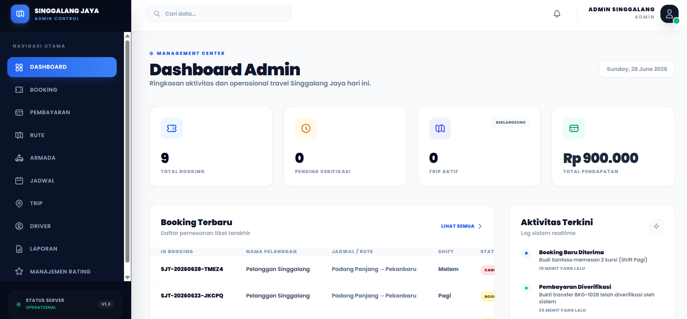

# Singgalang Jaya Travel System

Singgalang Jaya Travel System adalah aplikasi web untuk digitalisasi operasional travel antar kota. Sistem ini membantu pelanggan melakukan booking, admin mengelola jadwal/trip/pembayaran, dan driver menjalankan manifest perjalanan.

## Ringkasan Proyek

- Nama proyek: Singgalang Jaya Travel System
- Platform: Web application
- Framework backend: Laravel 13
- Frontend: Blade, Livewire, Alpine.js, Tailwind CSS, Vite
- Database: MySQL
- Integrasi eksternal: Fonnte API untuk notifikasi WhatsApp, Leaflet/OpenStreetMap untuk peta

## Aktor Sistem

| Aktor | Hak akses utama |
| --- | --- |
| Pelanggan | Register/login, melihat jadwal, booking, upload bukti DP, cek status booking, membatalkan booking |
| Admin | CRUD rute, armada, driver, jadwal, verifikasi pembayaran, kelola booking, buat trip, assign penumpang, laporan |
| Driver | Melihat dashboard trip, manifest penumpang, update status jemput/antar, konfirmasi pelunasan, selesaikan trip |

## Fitur Utama

- Authentication dan role-based access untuk admin, driver, dan pelanggan.
- Landing page dan jadwal keberangkatan publik.
- Booking travel pelanggan dengan kode booking `SJT-{YYYYMMDD}-{RANDOM5}`.
- Upload bukti pembayaran DP flat Rp50.000.
- Verifikasi pembayaran DP oleh admin.
- CRUD master data rute, jadwal, armada, dan driver.
- Manajemen trip, assign booking ke trip, dan manifest penumpang.
- Dashboard driver untuk operasional pickup, dropoff, pelunasan, dan penyelesaian trip.
- Laporan booking, trip, dan pendapatan.
- Notifikasi WhatsApp berbasis Fonnte API.
- GitHub Action CI untuk validasi build dan test.

## Tampilan Aplikasi (Screenshots)

Berikut adalah beberapa tampilan dari Singgalang Jaya Travel System:

### 1. Landing Page & Testimonial Carousel


### 2. Detail Booking & Pembayaran DP


## Dokumentasi UAS

Dokumen luaran UAS tersedia di folder `docs/`:

| Luaran | File |
| --- | --- |
| Ringkasan UAS | `docs/UAS-KONSTRUKSI-EVOLUSI-PERANGKAT-LUNAK.md` |
| Installation doc | `docs/INSTALLATION.MD` |
| Feature doc | `docs/features.md` |
| Dependency doc | `docs/dependencies.md` |
| Changelog | `docs/CHANGELOG.MD` |
| Pembagian peran GitHub | `docs/github-roles.md` |
| GitHub Action doc | `docs/github-actions.md` |
| Refactoring doc | `docs/refactoring.md` |
| Statement coverage | `docs/statemen-coverage.md` |

## Cara Menjalankan Cepat

```bash
composer install
npm install
cp .env.example .env
php artisan key:generate
php artisan migrate --seed
php artisan storage:link
npm run dev
php artisan serve
```

Akses aplikasi di `http://127.0.0.1:8000`.

## Akun Seeder

| Role | Email | Password |
| --- | --- | --- |
| Admin | `admin@gmail.com` | `admin12345` |
| Driver | `driver@gmail.com` | `driver12345` |
| Pelanggan | `pelanggan@gmail.com` | `pelanggan12345` |

## Quality Gate

Perintah verifikasi lokal:

```bash
npm run build
php artisan test
```

Workflow GitHub Actions ada di `.github/workflows/laravel-ci.yml` dan menjalankan instalasi dependency, build frontend, migration database test, serta test Laravel.

## Tim Pengembang

- Rayhan Ramadhan
- Rayfo Huda
- Kevin Maulana
- Nayasha Ananda Risdi

## Status

Proyek berada pada tahap pengembangan dan disusun sebagai luaran Project Based Learning serta UAS mata kuliah Konstruksi Evolusi Perangkat Lunak.
