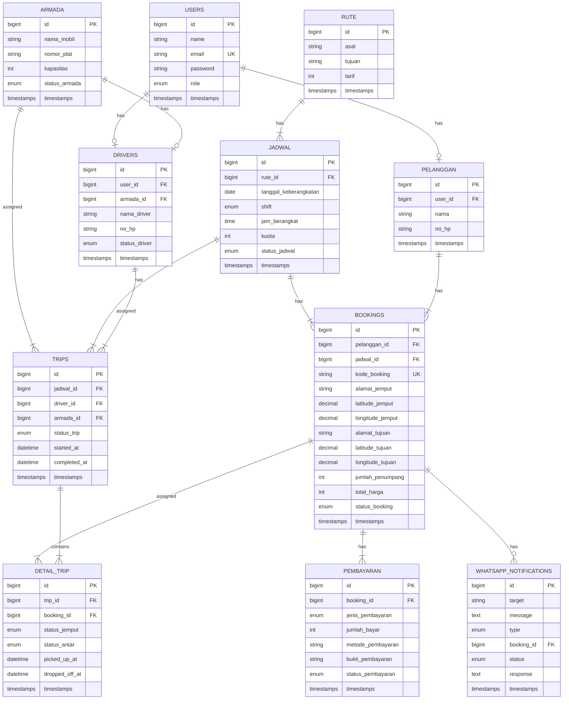

# Singgalang Jaya Travel — Database Schema

## ERD Diagram



---

## Detail Tabel

### 1. `users` — ✅ SUDAH ADA

| Column | Type | Constraint | Keterangan |
|--------|------|------------|------------|
| `id` | BIGINT UNSIGNED | PK, AUTO_INCREMENT | |
| `name` | VARCHAR(255) | NOT NULL | Nama user (Breeze default: `name` bukan `nama`) |
| `email` | VARCHAR(255) | NOT NULL, UNIQUE | Email login |
| `email_verified_at` | TIMESTAMP | NULLABLE | |
| `password` | VARCHAR(255) | NOT NULL | Hashed password |
| `role` | ENUM('admin', 'driver', 'pelanggan') | NOT NULL, DEFAULT 'pelanggan' | Role user |
| `remember_token` | VARCHAR(100) | NULLABLE | |
| `created_at` | TIMESTAMP | NULLABLE | |
| `updated_at` | TIMESTAMP | NULLABLE | |

**Migration**: 
- `0001_01_01_000000_create_users_table.php` ✅
- `2026_05_10_134752_add_role_to_users_table.php` ✅

**Tabel terkait yang sudah ada**:
- `password_reset_tokens` ✅
- `sessions` ✅
- `cache` + `cache_locks` ✅
- `jobs` + `job_batches` + `failed_jobs` ✅

**Model**: `App\Models\User` ✅
```php
#[Fillable(['name', 'email', 'password', 'role'])]
#[Hidden(['password', 'remember_token'])]
```

**Seeder**: `UserSeeder` ✅
- Admin: `admin@gmail.com` / `admin12345`
- Driver: `driver@gmail.com` / `driver12345`
- Pelanggan: `pelanggan@gmail.com` / `pelanggan12345`

> ⚠️ **PENTING**: User model pakai `name` (bukan `nama`). Ini default Breeze. Jangan ubah.

---

### 2. `armada` — ✅ SUDAH ADA

| Column | Type | Constraint | Keterangan |
|--------|------|------------|------------|
| `id` | BIGINT UNSIGNED | PK, AUTO_INCREMENT | |
| `nama_mobil` | VARCHAR(100) | NOT NULL | Merk/tipe kendaraan |
| `nomor_plat` | VARCHAR(20) | NOT NULL | Plat nomor kendaraan |
| `kapasitas` | INT UNSIGNED | NOT NULL, DEFAULT 5 | Kapasitas penumpang |
| `status_armada` | ENUM('aktif', 'nonaktif') | NOT NULL, DEFAULT 'aktif' | Status ketersediaan |
| `created_at` | TIMESTAMP | NULLABLE | |
| `updated_at` | TIMESTAMP | NULLABLE | |

**Migration**: `create_armada_table`

**Catatan**: Armada adalah tabel terpisah. Satu armada bisa memiliki 0 atau 1 driver (boleh belum punya driver). Satu driver HARUS memiliki 1 armada.

---

### 3. `drivers` — ✅ SUDAH ADA

| Column | Type | Constraint | Keterangan |
|--------|------|------------|------------|
| `id` | BIGINT UNSIGNED | PK, AUTO_INCREMENT | |
| `user_id` | BIGINT UNSIGNED | FK → users.id, UNIQUE | Relasi 1:1 ke user |
| `armada_id` | BIGINT UNSIGNED | FK → armada.id | Relasi ke armada (wajib) |
| `nama_driver` | VARCHAR(255) | NOT NULL | Nama lengkap driver |
| `no_hp` | VARCHAR(20) | NOT NULL | Nomor HP |
| `status_driver` | ENUM('aktif', 'nonaktif') | NOT NULL, DEFAULT 'aktif' | Status ketersediaan |
| `created_at` | TIMESTAMP | NULLABLE | |
| `updated_at` | TIMESTAMP | NULLABLE | |

**Migration**: `create_drivers_table`

**Index**: `user_id` (UNIQUE), `armada_id`

**Catatan**: Data kendaraan TIDAK lagi melekat pada driver. Driver memiliki foreign key `armada_id` yang merujuk ke tabel `armada`. Satu driver harus memiliki satu armada.

---

### 4. `rute` — ✅ SUDAH ADA

| Column | Type | Constraint | Keterangan |
|--------|------|------------|------------|
| `id` | BIGINT UNSIGNED | PK, AUTO_INCREMENT | |
| `asal` | VARCHAR(255) | NOT NULL | Kota asal |
| `tujuan` | VARCHAR(255) | NOT NULL | Kota tujuan |
| `tarif` | INT UNSIGNED | NOT NULL | Tarif per penumpang (Rp) |
| `created_at` | TIMESTAMP | NULLABLE | |
| `updated_at` | TIMESTAMP | NULLABLE | |

**Migration**: `create_rute_table`

**Data Awal (Seeder)**:
| Asal | Tujuan | Tarif |
|------|--------|-------|
| Padang Panjang | Pekanbaru | 150000 |
| Pekanbaru | Padang Panjang | 150000 |

---

### 5. `pelanggan` — ✅ SUDAH ADA

| Column | Type | Constraint | Keterangan |
|--------|------|------------|------------|
| `id` | BIGINT UNSIGNED | PK, AUTO_INCREMENT | |
| `user_id` | BIGINT UNSIGNED | FK → users.id, UNIQUE | Relasi 1:1 ke user (role pelanggan) |
| `nama` | VARCHAR(255) | NOT NULL | Nama lengkap pelanggan |
| `no_hp` | VARCHAR(20) | NOT NULL | Nomor HP |
| `created_at` | TIMESTAMP | NULLABLE | |
| `updated_at` | TIMESTAMP | NULLABLE | |

**Migration**: `create_pelanggan_table`

**Index**: `user_id` (UNIQUE)

**Catatan**: Pelanggan WAJIB register dan login (role `pelanggan`). Data pelanggan dibuat otomatis saat register atau saat pertama kali booking.

---

### 6. `jadwal` — ✅ SUDAH ADA

| Column | Type | Constraint | Keterangan |
|--------|------|------------|------------|
| `id` | BIGINT UNSIGNED | PK, AUTO_INCREMENT | |
| `rute_id` | BIGINT UNSIGNED | FK → rute.id | Relasi ke rute |
| `tanggal_keberangkatan` | DATE | NOT NULL | Tanggal berangkat |
| `shift` | ENUM('pagi', 'malam') | NOT NULL | Shift keberangkatan |
| `jam_berangkat` | TIME | NOT NULL | Jam berangkat |
| `kuota` | INT UNSIGNED | NOT NULL | Jumlah max penumpang per jadwal |
| `status_jadwal` | ENUM('aktif', 'nonaktif', 'penuh') | NOT NULL, DEFAULT 'aktif' | Status jadwal |
| `created_at` | TIMESTAMP | NULLABLE | |
| `updated_at` | TIMESTAMP | NULLABLE | |

**Migration**: `create_jadwal_table`

**Index**: `rute_id`, `tanggal_keberangkatan`, `shift`

**Catatan Jadwal**:
- Pagi: 08.00 - 10.00
- Malam: 20.00 - 22.00

---

### 7. `bookings` — ✅ SUDAH ADA

| Column | Type | Constraint | Keterangan |
|--------|------|------------|------------|
| `id` | BIGINT UNSIGNED | PK, AUTO_INCREMENT | |
| `pelanggan_id` | BIGINT UNSIGNED | FK → pelanggan.id | Relasi ke pelanggan |
| `jadwal_id` | BIGINT UNSIGNED | FK → jadwal.id | Relasi ke jadwal |
| `kode_booking` | VARCHAR(20) | NOT NULL, UNIQUE | Kode unik booking (auto-generated) |
| `alamat_jemput` | VARCHAR(500) | NOT NULL | Alamat penjemputan |
| `latitude_jemput` | DECIMAL(10,8) | NULLABLE | Lat penjemputan |
| `longitude_jemput` | DECIMAL(11,8) | NULLABLE | Lng penjemputan |
| `alamat_tujuan` | VARCHAR(500) | NOT NULL | Alamat tujuan |
| `latitude_tujuan` | DECIMAL(10,8) | NULLABLE | Lat tujuan |
| `longitude_tujuan` | DECIMAL(11,8) | NULLABLE | Lng tujuan |
| `jumlah_penumpang` | INT UNSIGNED | NOT NULL, DEFAULT 1 | Jumlah penumpang |
| `total_harga` | INT UNSIGNED | NOT NULL | Total harga (tarif × jumlah) |
| `status_booking` | ENUM(...) | NOT NULL, DEFAULT 'booking_dibuat' | Status booking |
| `created_at` | TIMESTAMP | NULLABLE | |
| `updated_at` | TIMESTAMP | NULLABLE | |

**Migration**: `create_bookings_table`

**Index**: `kode_booking` (UNIQUE), `pelanggan_id`, `jadwal_id`, `status_booking`

**Status Booking Values**:

| Value | Keterangan |
|-------|------------|
| `booking_dibuat` | Booking baru dibuat, menunggu upload bukti DP |
| `menunggu_verifikasi` | DP sudah diupload, menunggu verifikasi admin |
| `dikonfirmasi` | DP terverifikasi oleh admin |
| `assigned_to_trip` | Booking sudah dimasukkan ke trip |
| `on_trip` | Trip sedang berjalan |
| `completed` | Trip selesai |
| `cancelled` | Booking dibatalkan oleh pelanggan/admin (DP hangus) |
| `expired` | Booking kadaluarsa |

**Format Kode Booking**: `SJT-{YYYYMMDD}-{RANDOM5}` contoh: `SJT-20260605-A3X7K`

**Catatan**:
- Tidak ada `batas_bayar_at` (timer 30 menit dihapus).
- Tidak ada konsep `token booking`.
- DP flat Rp50.000 per booking.
- Pelanggan wajib login sebelum booking.
- Jika pelanggan membatalkan, DP hangus (tidak dikembalikan).

---

### 8. `pembayaran` — ✅ SUDAH ADA

| Column | Type | Constraint | Keterangan |
|--------|------|------------|------------|
| `id` | BIGINT UNSIGNED | PK, AUTO_INCREMENT | |
| `booking_id` | BIGINT UNSIGNED | FK → bookings.id | Relasi ke booking |
| `jenis_pembayaran` | ENUM('dp', 'pelunasan') | NOT NULL | Jenis pembayaran |
| `jumlah_bayar` | INT UNSIGNED | NOT NULL | Nominal pembayaran (Rp) |
| `metode_pembayaran` | VARCHAR(50) | NULLABLE | Transfer Bank / Cash |
| `bukti_pembayaran` | VARCHAR(255) | NULLABLE | Path file bukti upload |
| `status_pembayaran` | ENUM('menunggu', 'terverifikasi', 'ditolak') | NOT NULL, DEFAULT 'menunggu' | Status verifikasi |
| `created_at` | TIMESTAMP | NULLABLE | |
| `updated_at` | TIMESTAMP | NULLABLE | |

**Migration**: `create_pembayaran_table`

**Index**: `booking_id`, `status_pembayaran`

**Catatan**:
- Satu booking bisa punya banyak pembayaran (DP + pelunasan, atau upload ulang jika ditolak).
- DP adalah flat Rp50.000 per booking.
- Pelunasan = Total Tarif - DP. Dibayar langsung ke driver saat penjemputan/perjalanan.
- Kolom `catatan` dihapus dari tabel ini.

---

### 9. `trips` — ✅ SUDAH ADA

| Column | Type | Constraint | Keterangan |
|--------|------|------------|------------|
| `id` | BIGINT UNSIGNED | PK, AUTO_INCREMENT | |
| `jadwal_id` | BIGINT UNSIGNED | FK → jadwal.id | Relasi ke jadwal |
| `driver_id` | BIGINT UNSIGNED | FK → drivers.id | Relasi ke driver |
| `armada_id` | BIGINT UNSIGNED | FK → armada.id | Relasi ke armada |
| `status_trip` | ENUM('new', 'ready', 'on_trip', 'completed', 'cancelled') | NOT NULL, DEFAULT 'new' | Status trip |
| `started_at` | DATETIME | NULLABLE | Waktu mulai trip |
| `completed_at` | DATETIME | NULLABLE | Waktu selesai trip |
| `created_at` | TIMESTAMP | NULLABLE | |
| `updated_at` | TIMESTAMP | NULLABLE | |

**Migration**: `create_trips_table`

**Index**: `jadwal_id`, `driver_id`, `armada_id`, `status_trip`

**Catatan**: Trip sekarang memiliki `armada_id` terpisah selain `driver_id`. Admin assign driver DAN armada ke trip.

---

### 10. `detail_trip` — ✅ SUDAH ADA

| Column | Type | Constraint | Keterangan |
|--------|------|------------|------------|
| `id` | BIGINT UNSIGNED | PK, AUTO_INCREMENT | |
| `trip_id` | BIGINT UNSIGNED | FK → trips.id, ON DELETE CASCADE | Relasi ke trip |
| `booking_id` | BIGINT UNSIGNED | FK → bookings.id | Relasi ke booking |
| `status_jemput` | ENUM('belum', 'sudah_dijemput') | NOT NULL, DEFAULT 'belum' | Status penjemputan |
| `status_antar` | ENUM('belum', 'sudah_diantar') | NOT NULL, DEFAULT 'belum' | Status pengantaran |
| `picked_up_at` | DATETIME | NULLABLE | Waktu dijemput |
| `dropped_off_at` | DATETIME | NULLABLE | Waktu diantar |
| `created_at` | TIMESTAMP | NULLABLE | |
| `updated_at` | TIMESTAMP | NULLABLE | |

**Migration**: `create_detail_trip_table`

**Index**: `trip_id`, `booking_id`

**Unique Constraint**: `(trip_id, booking_id)` — satu booking hanya bisa masuk satu trip sekali.

---

### 11. `whatsapp_notifications` — ✅ SUDAH ADA

| Column | Type | Constraint | Keterangan |
|--------|------|------------|------------|
| `id` | BIGINT UNSIGNED | PK, AUTO_INCREMENT | |
| `booking_id` | BIGINT UNSIGNED | FK → bookings.id, NULLABLE | Relasi ke booking (optional) |
| `target` | VARCHAR(20) | NOT NULL | Nomor HP tujuan |
| `message` | TEXT | NOT NULL | Isi pesan WhatsApp |
| `type` | ENUM('konfirmasi_keberangkatan', 'pembatalan_booking', 'reminder_dp', 'custom') | NOT NULL | Tipe notifikasi |
| `status` | ENUM('pending', 'sent', 'failed') | NOT NULL, DEFAULT 'pending' | Status pengiriman |
| `response` | TEXT | NULLABLE | Response dari FonnteAPI |
| `created_at` | TIMESTAMP | NULLABLE | |
| `updated_at` | TIMESTAMP | NULLABLE | |

**Migration**: `create_whatsapp_notifications_table`

**Index**: `booking_id`, `type`, `status`

**Catatan**: Tabel ini digunakan untuk logging semua notifikasi WhatsApp yang dikirim via FonnteAPI. Berguna untuk audit trail dan retry jika gagal.

---

## Relasi Antar Tabel

| Relasi | Tipe | Keterangan |
|--------|------|------------|
| `users` → `drivers` | 1:1 | Satu user (role driver) punya satu data driver |
| `users` → `pelanggan` | 1:1 | Satu user (role pelanggan) punya satu data pelanggan |
| `armada` → `drivers` | 1:0..1 | Satu armada bisa punya 0 atau 1 driver |
| `drivers` → `armada` | N:1 | Satu driver harus punya 1 armada |
| `rute` → `jadwal` | 1:N | Satu rute punya banyak jadwal. Jadwal mengambil tarif dari rute |
| `jadwal` → `bookings` | 1:N | Satu jadwal punya banyak booking |
| `jadwal` → `trips` | 1:N | Satu jadwal bisa punya banyak trip |
| `pelanggan` → `bookings` | 1:N | Satu pelanggan bisa punya banyak booking |
| `bookings` → `pembayaran` | 1:N | Satu booking bisa punya banyak pembayaran |
| `bookings` → `detail_trip` | 1:N | Satu booking bisa masuk banyak detail trip |
| `bookings` → `whatsapp_notifications` | 1:N | Satu booking bisa punya banyak notifikasi WA |
| `trips` → `detail_trip` | 1:N | Satu trip punya banyak detail trip |
| `drivers` → `trips` | 1:N | Satu driver bisa handle banyak trip |
| `armada` → `trips` | 1:N | Satu armada bisa dipakai banyak trip |

---

## Migration Order

| Urutan | Migration | Tabel | Status |
|:------:|-----------|-------|--------|
| 1 | `create_users_table` | `users` | ✅ Sudah ada |
| 2 | `create_cache_table` | `cache`, `cache_locks` | ✅ Sudah ada |
| 3 | `create_jobs_table` | `jobs`, `job_batches`, `failed_jobs` | ✅ Sudah ada |
| 4 | `add_role_to_users_table` | `users` (alter) | ✅ Sudah ada |
| 5 | `create_armada_table` | `armada` | ✅ |
| 6 | `create_drivers_table` | `drivers` | ✅ |
| 7 | `create_rute_table` | `rute` | ✅ |
| 8 | `create_pelanggan_table` | `pelanggan` | ✅ |
| 9 | `create_jadwal_table` | `jadwal` | ✅ |
| 10 | `create_bookings_table` | `bookings` | ✅ |
| 11 | `create_pembayaran_table` | `pembayaran` | ✅ |
| 12 | `create_trips_table` | `trips` | ✅ |
| 13 | `create_detail_trip_table` | `detail_trip` | ✅ |
| 14 | `create_whatsapp_notifications_table` | `whatsapp_notifications` | ✅ |

---

## Seeder

| Seeder | Status | Keterangan |
|--------|--------|------------|
| `UserSeeder` | ✅ Sudah ada | Admin + Driver + Pelanggan default |
| `RuteSeeder` | ✅ | 2 rute utama (PP↔PKU) |
| `ArmadaSeeder` | ✅ | 2-3 sample armada |
| `DriverSeeder` | ✅ | 2-3 sample driver + link ke armada |
| `JadwalSeeder` | 🔲 | Sample jadwal untuk testing |
| `BookingSeeder` | 🔲 | Sample booking (optional, for dev) |

---

## Model Relationships (Eloquent)

```
User        → hasOne(Driver)                                            ✅
User        → hasOne(Pelanggan)                                          ✅
Armada      → hasOne(Driver), hasMany(Trip)                             ✅
Driver      → belongsTo(User), belongsTo(Armada), hasMany(Trip)         ✅
Rute        → hasMany(Jadwal)                                           ✅
Jadwal      → belongsTo(Rute), hasMany(Booking), hasMany(Trip)          ✅
Pelanggan   → belongsTo(User), hasMany(Booking)                         ✅
Booking     → belongsTo(Pelanggan), belongsTo(Jadwal), hasMany(Pembayaran), hasMany(DetailTrip), hasMany(WhatsappNotification)  ✅
Pembayaran  → belongsTo(Booking)                                        ✅
Trip        → belongsTo(Jadwal), belongsTo(Driver), belongsTo(Armada), hasMany(DetailTrip)  ✅
DetailTrip  → belongsTo(Trip), belongsTo(Booking)                       ✅
WhatsappNotification → belongsTo(Booking)                               ✅
```
