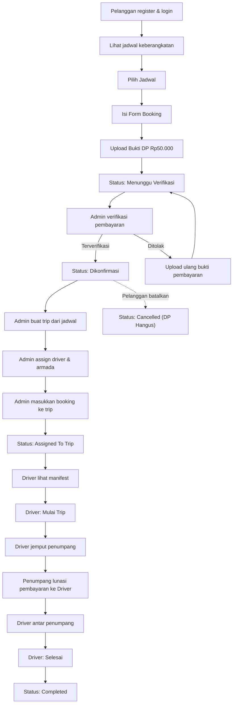

# Singgalang Jaya Travel — Project Context

## 1. Latar Belakang

Singgalang Jaya Travel adalah usaha jasa transportasi antar kota yang melayani perjalanan utama antara **Padang Panjang** dan **Pekanbaru** dengan sistem antar-jemput penumpang (*door to door service*).

Saat ini proses pemesanan masih dilakukan secara manual melalui WhatsApp dan telepon sehingga:
- Data booking tidak tersimpan secara terstruktur.
- Koordinasi operasional masih bergantung pada komunikasi manual.

Untuk mengatasi permasalahan tersebut, akan dibangun sebuah **sistem informasi berbasis web** yang membantu proses pemesanan, pengelolaan jadwal keberangkatan, manajemen driver dan armada, pengelolaan trip, serta monitoring operasional travel secara digital.

---

## 2. Tujuan Sistem

- Digitalisasi proses pemesanan travel.
- Menyimpan data pelanggan dan transaksi secara terpusat.
- Mempermudah pengelolaan jadwal keberangkatan.
- Mempermudah verifikasi pembayaran DP.
- Mengelola data armada dan driver secara terpisah.
- Membantu admin mengelompokkan penumpang ke dalam trip.
- Membantu driver melihat manifest penumpang dan lokasi penjemputan.
- Menyediakan media promosi layanan Singgalang Jaya Travel.

---

## 3. Aktor Sistem

### Pelanggan (Wajib Register & Login)

> ⚠️ Pelanggan WAJIB register dan login sebelum melakukan booking.

| Aksi | Keterangan |
|------|------------|
| Register & Login | Membuat akun pelanggan (role `pelanggan`) |
| Melihat informasi travel | Landing page & info layanan |
| Melihat jadwal keberangkatan | Jadwal harian yang tersedia |
| Melakukan booking | Form booking (harus login, hanya pada jadwal tersedia) |
| Upload bukti pembayaran DP | Bukti transfer DP Rp50.000 |
| Melihat status booking | Dari halaman "Booking Saya" |
| Melihat informasi driver | Info driver setelah booking di-assign ke trip |
| Menerima notifikasi WhatsApp | Konfirmasi ulang pagi hari sebelum keberangkatan |

### Admin / Koordinator

| Aksi | Keterangan |
|------|------------|
| Mengelola rute | CRUD rute perjalanan |
| Mengelola armada | CRUD data armada/kendaraan |
| Mengelola driver | CRUD data driver (assign armada ke driver) |
| Mengelola jadwal | CRUD jadwal keberangkatan |
| Mengelola booking | Lihat, konfirmasi, batalkan booking |
| Memverifikasi pembayaran | Verifikasi bukti DP dari pelanggan |
| Membuat trip | Buat trip dari jadwal, assign driver & armada |
| Mengelompokkan penumpang ke trip | Assign booking ke trip tertentu |
| Melihat manifest | Lihat daftar penumpang per trip |
| Melihat laporan | Laporan booking, trip, pendapatan |
| Monitoring operasional | Pantau status trip berjalan |

### Driver (Memiliki Akun Login)

| Aksi | Keterangan |
|------|------------|
| Melihat trip yang ditugaskan | Dashboard trip hari ini |
| Melihat manifest penumpang | Daftar penumpang, alamat jemput, titik maps, sisa pembayaran |
| Melihat lokasi jemput | Titik penjemputan di peta (Leaflet) |
| Menghubungi penumpang | Hubungi via telepon/WA |
| Update status trip | Mulai Trip, Berangkat, Tiba, Selesai |
| Checklist penumpang | Tandai penumpang sudah dijemput/diantar |
| Konfirmasi pelunasan | Konfirmasi menerima pelunasan dari pelanggan |
| Melihat riwayat trip | Riwayat trip yang sudah selesai |

---

## 4. Business Rules

### Rute Utama

| Rute | Keterangan |
|------|------------|
| Padang Panjang → Pekanbaru | Rute pergi |
| Pekanbaru → Padang Panjang | Rute pulang |

> Admin WAJIB membuat Rute terlebih dahulu sebelum membuat Jadwal.

### Jadwal

- Tersedia **dua shift**: Pagi & Malam.
- Pagi: 08.00 - 10.00
- Malam: 20.00 - 22.00
- Jadwal dibuat oleh admin setelah Rute tersedia.
- Jadwal mengambil tarif dari Rute.

### Tarif & Pembayaran

| Item | Nilai | Keterangan |
|------|-------|------------|
| **Tarif** | Ditentukan oleh harga pada Rute | Tarif per rute, bukan per jarak |
| **Total Tarif** | Harga Rute × Jumlah Penumpang | Dihitung otomatis saat booking |
| **DP (Uang Muka)** | Rp50.000/booking | **Flat**, tidak menggunakan persentase |
| **Pelunasan** | Sisa (Total Tarif - DP) | Dibayar langsung ke Driver saat penjemputan/perjalanan |

> DP menggunakan **nominal tetap Rp50.000** per booking.
> Pembayaran menggunakan **upload bukti transfer** dan verifikasi admin.
> Driver menerima pelunasan **langsung dari pelanggan** saat penjemputan/perjalanan.

### Booking

- Pelanggan WAJIB register dan login sebelum booking.
- Booking hanya dapat dilakukan pada jadwal yang tersedia.
- Booking dapat berisi lebih dari satu penumpang melalui field `jumlah_penumpang`.
- Tidak perlu menyimpan nama setiap penumpang.
- Lokasi jemput dan tujuan menggunakan Leaflet Map.
- Leaflet hanya untuk operasional dan navigasi, BUKAN untuk menghitung tarif.
- Tidak ada konsep `token booking`.
- Tetap menggunakan `kode_booking` (format: `SJT-{YYYYMMDD}-{RANDOM5}`).

### Pembatalan

- Pelanggan dapat membatalkan booking.
- DP **hangus** apabila pelanggan membatalkan perjalanan setelah DP dibayar.
- **Tidak ada pengembalian DP**.

### Driver & Armada

- **Armada adalah tabel terpisah** dari driver.
- 1 Driver HARUS memiliki 1 Armada.
- 1 Armada BOLEH belum memiliki Driver.
- Admin mengelola armada dan driver secara independen.
- Admin assign armada ke driver.

### Trip

- Trip dibuat dari Jadwal.
- 1 Jadwal bisa memiliki banyak Trip.
- Create Trip WAJIB memilih Driver DAN Armada.
- Admin assign booking ke trip.

---

## 5. Konsep Trip

Trip merupakan **inti operasional** sistem.

### Alur

```
Jadwal → Trip (pilih Driver + Armada) → Daftar Booking
```

### Contoh

```
Jadwal: 15 Juni 2026, Shift Pagi

├── Trip 1
│   ├── Driver A + Armada X
│   └── Booking: B001, B002, B003, B004
│
└── Trip 2
    ├── Driver B + Armada Y
    └── Booking: B005, B006, B007
```

> Satu jadwal dapat memiliki **lebih dari satu trip** apabila jumlah penumpang melebihi kapasitas kendaraan.

### Driver Flow (Alur Operasional Driver)

```
Mulai Trip → Menjemput → Berangkat → Tiba → Selesai
```

---

## 6. Alur Bisnis Sistem



### Status Booking Flow

| Status | Label | Trigger | Aktor |
|--------|-------|---------|-------|
| `booking_dibuat` | Booking Dibuat | Booking baru dibuat, menunggu upload DP | Sistem |
| `menunggu_verifikasi` | Menunggu Verifikasi | Bukti DP diupload | Pelanggan |
| `dikonfirmasi` | Dikonfirmasi | DP diverifikasi admin | Admin |
| `assigned_to_trip` | Assigned To Trip | Booking dimasukkan ke trip | Admin |
| `on_trip` | On Trip | Driver mulai trip | Driver |
| `completed` | Completed | Trip diselesaikan driver | Driver |
| `cancelled` | Cancelled | Booking dibatalkan (DP hangus) | Pelanggan/Admin |
| `expired` | Expired | Booking kadaluarsa | Sistem |

### Status Trip Flow

| Status | Label | Trigger | Aktor |
|--------|-------|---------|-------|
| `new` | New | Trip baru dibuat | Admin |
| `ready` | Ready | Trip siap berangkat | Admin |
| `on_trip` | On Trip | Driver mulai trip | Driver |
| `completed` | Completed | Trip diselesaikan | Driver |
| `cancelled` | Cancelled | Trip dibatalkan | Admin |

---

## 7. Tech Stack

| Layer | Teknologi | Versi |
|-------|-----------|-------|
| **Backend** | Laravel | 13.x |
| **Frontend** | Blade + Livewire | Livewire 4.3 |
| **Interaktif** | Alpine.js | 3.x |
| **CSS** | TailwindCSS | 3.x |
| **Auth** | Laravel Breeze (Blade stack) | 2.4 |
| **Database** | MySQL | — |
| **Maps** | Leaflet + OpenStreetMap | 1.9.x |
| **Notifikasi WhatsApp** | FonnteAPI | — |
| **Build Tool** | Vite | 8.x |
| **HTTP Client** | Axios | 1.16.x |

### Packages Terpasang

```json
// composer.json (require)
"laravel/framework": "^13.0"
"livewire/livewire": "^4.3"

// composer.json (require-dev)
"laravel/breeze": "^2.4"

// package.json
"alpinejs": "^3.4.2"
"tailwindcss": "^3.1.0"
"@tailwindcss/forms": "^0.5.2"
"axios": "^1.16.0"
```

---

## 8. Status Implementasi Saat Ini

### ✅ Sudah Selesai

| Item | Detail |
|------|--------|
| Setup Laravel 13 | Project initialized |
| Install Livewire 4.3 | `livewire/livewire` terpasang |
| Install Breeze (Blade) | Auth scaffolding lengkap |
| Users migration | Tabel `users` + `sessions` + `password_reset_tokens` |
| Role migration | Kolom `role` ENUM('admin','driver') di `users` |
| User model | `#[Fillable(['name', 'email', 'password', 'role'])]` |
| RoleMiddleware | `App\Http\Middleware\RoleMiddleware` — cek role dari `...$roles` |
| Middleware registration | Alias `role` di `bootstrap/app.php` |
| Auth controllers | Breeze: Login, Register, Password, Profile, dll |
| Login redirect by role | Admin → `/admin/dashboard`, Driver → `/driver/dashboard` |
| Route groups | `admin.*` (role:admin), `driver.*` (role:driver) |
| Seeders | Admin: `admin@gmail.com`/`admin12345`, Driver: `driver@gmail.com`/`driver12345`, DriverSeeder, RuteSeeder |
| Custom Layouts | `layouts.public`, `layouts.admin`, `layouts.driver` (Template Inheritance) |
| Blade Components | 13 Breeze components + custom components (sidebar-admin, sidebar-driver, status-badge, alert, card) |
| Models & Migrations | Tabel operasional + model & relationships |
| Admin Dashboard | Dashboard utama dengan Sidebar layout kustom |
| Driver Dashboard | Dashboard utama dengan Sidebar layout kustom |
| Profile | Edit profile page + partials |
| Livewire directory | `app/Livewire/` (terstruktur), `resources/views/livewire/` |

### 🔲 Belum Dikerjakan (Perubahan dari Keputusan Final)

- Tambah tabel `armada` (terpisah dari driver)
- Tambah kolom `armada_id` pada tabel `drivers`
- Tambah kolom `armada_id` pada tabel `trips`
- CRUD Armada (Admin)
- Update CRUD Driver (link ke armada)
- Update Trip management (assign armada)
- Booking flow tanpa timer 30 menit
- Hapus konsep token booking
- Driver konfirmasi pelunasan

---

## 9. Scope / Modul Sistem

| # | Modul | Keterangan |
|---|-------|------------|
| 1 | **Landing Page** | Halaman utama promosi & info layanan |
| 2 | **Jadwal Keberangkatan** | Daftar jadwal yang tersedia untuk pelanggan |
| 3 | **Booking Travel** | Form pemesanan perjalanan |
| 4 | **Pembayaran DP** | Upload bukti transfer DP Rp50.000 |
| 5 | **Booking Saya** | Status dan riwayat booking pelanggan |
| 6 | **Dashboard Admin** | Panel admin untuk operasional |
| 7 | **Armada Management** | CRUD data armada/kendaraan |
| 8 | **Driver Management** | CRUD data driver (link ke armada) |
| 9 | **Trip Management** | Buat trip, assign driver & armada, kelompokkan booking |
| 10 | **Manifest Penumpang** | Daftar penumpang per trip |
| 11 | **Dashboard Driver** | Panel driver untuk trip & manifest |
| 12 | **Integrasi Maps** | Leaflet map untuk titik jemput/antar |
| 13 | **Laporan** | Laporan booking, trip, pendapatan |

---

## 10. Struktur Database (Konseptual)

### Tabel Utama

| Tabel | Keterangan |
|-------|------------|
| `users` | Admin, driver, pelanggan (auth) — **SUDAH ADA** |
| `armada` | Data armada/kendaraan |
| `drivers` | Data driver (link ke armada) |
| `rute` | Rute perjalanan |
| `pelanggan` | Data pelanggan |
| `jadwal` | Jadwal keberangkatan |
| `bookings` | Data pemesanan pelanggan |
| `pembayaran` | Bukti pembayaran DP & pelunasan |
| `trips` | Trip operasional (link ke driver & armada) |
| `detail_trip` | Pivot: booking ↔ trip + status jemput/antar |
| `whatsapp_notifications` | Log notifikasi WhatsApp |

### Relasi Utama

```
users        1 ──── 1 drivers
users        1 ──── 1 pelanggan
armada       1 ──── 0..1 drivers
drivers      N ──── 1 armada
rute         1 ──── * jadwal
jadwal       1 ──── * bookings
jadwal       1 ──── * trips
pelanggan    1 ──── * bookings
bookings     1 ──── * pembayaran
bookings     1 ──── * detail_trip
trips        1 ──── * detail_trip
drivers      1 ──── * trips
armada       1 ──── * trips
```

---

## 11. Konvensi & Aturan Pengembangan

- **Bahasa kode**: English (variabel, function, route name).
- **Nama tabel & kolom**: Bahasa Indonesia (sesuai ERD).
- **Bahasa UI**: Bahasa Indonesia (label, pesan, konten).
- **Route naming**: `resource.action` (contoh: `admin.bookings.index`).
- **Controller**: Satu controller per resource.
- **View**: Blade (slot-based layout via Breeze) + **Livewire components** untuk interaktif.
- **CSS**: TailwindCSS v3 + `@tailwindcss/forms`.
- **Auth**: Laravel Breeze (sudah terpasang). Role-based via `RoleMiddleware`.
- **Pelanggan WAJIB login**: Register sebagai role `pelanggan`. Booking memerlukan auth.
- **User model field**: `name` (bukan `nama`) — mengikuti Breeze default.
- **User roles**: `admin`, `driver`, `pelanggan`.

## 12. Keputusan Implementasi Final

Perubahan yang harus dilakukan pada sistem:

- Tambah tabel `armada`
- Tambah kolom `armada_id` pada tabel `drivers`
- Tambah kolom `armada_id` pada tabel `trips`
- Tetap menggunakan `kode_booking`
- Hapus konsep `token booking`
- Pelanggan wajib login sebelum melakukan booking
- DP menggunakan nominal tetap Rp50.000
- Pembayaran menggunakan upload bukti transfer dan verifikasi admin
- Driver menerima pelunasan langsung dari pelanggan saat penjemputan/perjalanan
