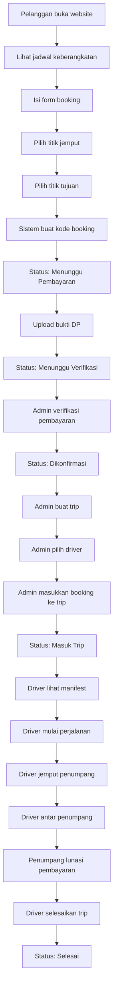

# Singgalang Jaya Travel — Project Context

## 1. Latar Belakang

Singgalang Jaya Travel adalah usaha jasa transportasi antar kota yang melayani perjalanan utama antara **Padang Panjang** dan **Pekanbaru** dengan sistem antar-jemput penumpang (*door to door service*).

Saat ini proses pemesanan masih dilakukan secara manual melalui WhatsApp dan telepon sehingga:
- Data booking tidak tersimpan secara terstruktur.
- Koordinasi operasional masih bergantung pada komunikasi manual.

Untuk mengatasi permasalahan tersebut, akan dibangun sebuah **sistem informasi berbasis web** yang membantu proses pemesanan, pengelolaan perjalanan, dan operasional travel secara digital.

---

## 2. Tujuan Sistem

- Digitalisasi proses booking travel.
- Menyimpan data pelanggan dan transaksi secara terpusat.
- Mempermudah pengelolaan jadwal keberangkatan.
- Mempermudah verifikasi pembayaran DP.
- Membantu admin mengelompokkan penumpang ke dalam trip.
- Membantu driver melihat manifest penumpang dan lokasi penjemputan.
- Menyediakan media promosi layanan Singgalang Jaya Travel.

---

## 3. Aktor Sistem

### Pelanggan (Guest — Tanpa Login)

| Aksi | Keterangan |
|------|------------|
| Melihat informasi travel | Landing page & info layanan |
| Melihat jadwal keberangkatan | Jadwal harian yang tersedia |
| Melakukan booking | Form booking tanpa perlu akun |
| Upload bukti pembayaran DP | Bukti transfer DP Rp50.000 |
| Melihat status booking | Menggunakan **kode booking** |
| Menghubungi admin | Via WhatsApp link |

### Admin (Koordinator Operasional)

| Aksi | Keterangan |
|------|------------|
| Mengelola jadwal | CRUD jadwal keberangkatan |
| Mengelola booking | Lihat, konfirmasi, batalkan booking |
| Memverifikasi pembayaran | Verifikasi bukti DP dari pelanggan |
| Mengelola driver | CRUD data driver & kendaraan |
| Membuat trip | Buat trip berdasarkan jadwal |
| Mengelompokkan penumpang ke trip | Assign booking ke trip tertentu |
| Melihat laporan | Laporan booking, pendapatan, operasional |
| Monitoring operasional | Pantau status trip berjalan |

### Driver (Memiliki Akun Login)

| Aksi | Keterangan |
|------|------------|
| Melihat trip yang ditugaskan | Dashboard trip aktif |
| Melihat manifest penumpang | Daftar penumpang dalam trip |
| Melihat lokasi jemput | Titik penjemputan di peta |
| Update status penjemputan | Tandai penumpang sudah dijemput |
| Update status pengantaran | Tandai penumpang sudah diantar |
| Menyelesaikan trip | Tandai trip selesai |

---

## 4. Business Rules

### Rute Utama

| Rute | Keterangan |
|------|------------|
| Padang Panjang → Pekanbaru | Rute pergi |
| Pekanbaru → Padang Panjang | Rute pulang |

### Tarif & Pembayaran

| Item | Nilai | Keterangan |
|------|-------|------------|
| **Tarif** | Rp150.000/penumpang | Berlaku tetap untuk seluruh rute utama |
| **DP (Uang Muka)** | Rp50.000/booking | Tanda jadi pemesanan |
| **Pelunasan** | Rp100.000 | Dibayar langsung ke driver saat perjalanan |

### Pembatalan

- DP **hangus** apabila pelanggan membatalkan perjalanan.
- **Tidak ada pengembalian DP**.

### Jadwal

- Tersedia **dua shift**: Pagi & Malam.
- Jadwal dibuat oleh admin.

### Driver

- Driver ditentukan oleh admin.
- Data kendaraan melekat pada data driver (tidak ada tabel armada terpisah).

---

## 5. Konsep Trip

Trip merupakan **inti operasional** sistem.

### Alur

```
Jadwal → Trip → Driver → Daftar Booking
```

### Contoh

```
Jadwal: 05 Juni 2026, Shift Pagi

├── Trip 1
│   ├── Driver A (Toyota Avanza, BA 1234 XX, Kapasitas: 5)
│   └── 5 Penumpang
│
└── Trip 2
    ├── Driver B (Toyota Innova, BA 5678 YY, Kapasitas: 5)
    └── 5 Penumpang
```

> Satu jadwal dapat memiliki **lebih dari satu trip** apabila jumlah penumpang melebihi kapasitas kendaraan.

---

## 6. Konsep Driver & Kendaraan

Untuk menyederhanakan sistem, **armada tidak dibuat sebagai tabel terpisah**. Data kendaraan disimpan langsung pada data driver.

### Struktur Data Driver

| Field | Contoh |
|-------|--------|
| Nama | Budi |
| Mobil | Toyota Avanza |
| Plat Nomor | BA 1234 XX |
| Kapasitas | 5 Orang |
| No. HP | 08xxxxxxxxxx |

---

## 7. Alur Bisnis Sistem



### Status Booking Flow

| Status | Trigger | Aktor |
|--------|---------|-------|
| `menunggu_pembayaran` | Booking baru dibuat | Sistem |
| `menunggu_verifikasi` | Bukti DP diupload | Pelanggan |
| `dikonfirmasi` | DP diverifikasi admin | Admin |
| `masuk_trip` | Booking dimasukkan ke trip | Admin |
| `dalam_perjalanan` | Driver mulai trip | Driver |
| `selesai` | Trip diselesaikan driver | Driver |
| `dibatalkan` | Booking dibatalkan | Admin |

---

## 8. Tech Stack

| Layer | Teknologi | Versi |
|-------|-----------|-------|
| **Backend** | Laravel | 13.x |
| **Frontend** | Blade + Livewire | Livewire 4.3 |
| **Interaktif** | Alpine.js | 3.x |
| **CSS** | TailwindCSS | 3.x |
| **Auth** | Laravel Breeze (Blade stack) | 2.4 |
| **Database** | MySQL | — |
| **Maps** | Leaflet + OpenStreetMap | 1.9.x |
| **Notifikasi** | WhatsApp Link (wa.me) | — |
| **Build Tool** | Vite | 8.x |
| **HTTP Client** | Axios | 1.16.x |

### Packages Terpasang

```json
// composer.json (require)
"laravel/framework": "^13.0"
"livewire/livewire": "^4.3"

// composer.json (require-dev)
"laravel/breeze": "^2.4"

// package.json
"alpinejs": "^3.4.2"
"tailwindcss": "^3.1.0"
"@tailwindcss/forms": "^0.5.2"
"axios": "^1.16.0"
```

---

## 9. Status Implementasi Saat Ini

### ✅ Sudah Selesai

| Item | Detail |
|------|--------|
| Setup Laravel 13 | Project initialized |
| Install Livewire 4.3 | `livewire/livewire` terpasang |
| Install Breeze (Blade) | Auth scaffolding lengkap |
| Users migration | Tabel `users` + `sessions` + `password_reset_tokens` |
| Role migration | Kolom `role` ENUM('admin','driver') di `users` |
| User model | `#[Fillable(['name', 'email', 'password', 'role'])]` |
| RoleMiddleware | `App\Http\Middleware\RoleMiddleware` — cek role dari `...$roles` |
| Middleware registration | Alias `role` di `bootstrap/app.php` |
| Auth controllers | Breeze: Login, Register, Password, Profile, dll |
| Login redirect by role | Admin → `/admin/dashboard`, Driver → `/driver/dashboard` |
| Route groups | `admin.*` (role:admin), `driver.*` (role:driver) |
| Seeders | Admin: `admin@gmail.com`/`admin12345`, Driver: `driver@gmail.com`/`driver12345`, DriverSeeder, RuteSeeder |
| Custom Layouts | `layouts.public`, `layouts.admin`, `layouts.driver` (Template Inheritance) |
| Blade Components | 13 Breeze components + custom components (sidebar-admin, sidebar-driver, status-badge, alert, card) |
| Models & Migrations | 8 tabel baru + model & relationships lengkap (User, Driver, Rute, Pelanggan, Jadwal, Booking, Pembayaran, Trip, DetailTrip) |
| Admin Dashboard | Dashboard utama dengan Sidebar layout kustom |
| Driver Dashboard | Dashboard utama dengan Sidebar layout kustom |
| Profile | Edit profile page + partials |
| Livewire directory | `app/Livewire/` (terstruktur), `resources/views/livewire/` |

### 🔲 Belum Dikerjakan

- Semua CRUD module (Rute, Jadwal, Driver)
- Booking flow (Form, Review, Pembayaran Page, Cek Status)
- Trip management (Admin Trip, Driver Panel & Operations)
- Maps integration (Leaflet picker & viewer)
- Laporan & Export

---

## 10. Scope / Modul Sistem

| # | Modul | Keterangan |
|---|-------|------------|
| 1 | **Landing Page** | Halaman utama promosi & info layanan |
| 2 | **Jadwal Keberangkatan** | Daftar jadwal yang tersedia untuk pelanggan |
| 3 | **Booking Travel** | Form pemesanan perjalanan |
| 4 | **Pembayaran DP** | Upload bukti transfer DP |
| 5 | **Cek Status Booking** | Cek status via kode booking |
| 6 | **Dashboard Admin** | Panel admin untuk operasional |
| 7 | **Driver Management** | CRUD data driver & kendaraan |
| 8 | **Trip Management** | Buat trip, assign driver, kelompokkan booking |
| 9 | **Manifest Penumpang** | Daftar penumpang per trip |
| 10 | **Dashboard Driver** | Panel driver untuk trip & manifest |
| 11 | **Integrasi Maps** | Leaflet map untuk titik jemput/antar |
| 12 | **Laporan** | Laporan booking, pendapatan, operasional |

---

## 11. Struktur Database (Konseptual)

### Tabel Utama

| Tabel | Keterangan |
|-------|------------|
| `users` | Admin & driver (auth) — **SUDAH ADA** |
| `drivers` | Data driver + kendaraan |
| `rute` | Rute perjalanan |
| `pelanggan` | Data pelanggan (auto-create saat booking) |
| `jadwal` | Jadwal keberangkatan |
| `bookings` | Data pemesanan pelanggan |
| `pembayaran` | Bukti pembayaran DP |
| `trips` | Trip operasional |
| `detail_trip` | Pivot: booking ↔ trip + status jemput/antar |

### Relasi Utama

```
users        1 ──── 1 drivers
rute         1 ──── * jadwal
jadwal       1 ──── * bookings
jadwal       1 ──── * trips
pelanggan    1 ──── * bookings
bookings     1 ──── * pembayaran
bookings     1 ──── * detail_trip
trips        1 ──── * detail_trip
drivers      1 ──── * trips
```

---

## 12. Konvensi & Aturan Pengembangan

- **Bahasa kode**: English (variabel, function, route name).
- **Nama tabel & kolom**: Bahasa Indonesia (sesuai ERD).
- **Bahasa UI**: Bahasa Indonesia (label, pesan, konten).
- **Route naming**: `resource.action` (contoh: `admin.bookings.index`).
- **Controller**: Satu controller per resource.
- **View**: Blade (slot-based layout via Breeze) + **Livewire components** untuk interaktif.
- **CSS**: TailwindCSS v3 + `@tailwindcss/forms`.
- **Auth**: Laravel Breeze (sudah terpasang). Role-based via `RoleMiddleware`.
- **No login untuk pelanggan**: Akses via kode booking.
- **User model field**: `name` (bukan `nama`) — mengikuti Breeze default.
