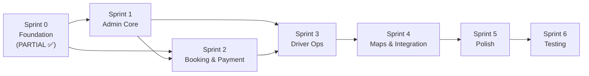

# Singgalang Jaya Travel — Sprint Planning & Pembagian Kerja

## Tim Pengembang

| Nama | Kode |
|------|------|
| Rayhan | RYH |
| Rayfo | RYF |
| Nayasha | NYS |
| Kevin | KVN |

---

## Status Saat Ini

### ✅ Sudah Selesai (Sprint 0 — Foundation)

| Item | Status |
|------|--------|
| Setup Laravel 13 | ✅ |
| Install Livewire 4.3 | ✅ |
| Install Laravel Breeze (Blade) | ✅ |
| TailwindCSS + Vite + Alpine.js | ✅ |
| Database MySQL config | ✅ |
| Migration: `users` + 8 tabel operasional baru | ✅ |
| User model + 8 model operasional baru | ✅ |
| RoleMiddleware & registration | ✅ |
| Auth controllers & views (Breeze) | ✅ |
| Login redirect by role | ✅ |
| Route groups (admin.*, driver.*) | ✅ |
| Seeders (Admin, Driver, Rute) | ✅ |
| Profile page + edit | ✅ |
| Custom layouts (`layouts.public`, `layouts.admin`, `layouts.driver`) | ✅ |
| Custom components (sidebar-admin, sidebar-driver, status-badge, alert, card) | ✅ |
| Upgrade admin dashboard (proper layout) | ✅ |
| Upgrade driver dashboard (proper layout) | ✅ |

### 🔲 Belum Dikerjakan

- Semua CRUD module (Rute, Jadwal, Driver)
- Booking flow (Form, Review, Pembayaran Page, Cek Status)
- Trip management (Admin Trip, Driver Panel & Operations)
- Maps integration (Leaflet picker & viewer)
- Laporan & Export

---

## Pembagian Fitur Per Anggota

### Rayhan (RYH) — Customer Interface

| Modul | Routes | Views |
|-------|:------:|:-----:|
| Landing Page | 1 | 1 |
| Jadwal Public | 1 | 1 |
| Booking Flow | 3 | 3 |
| Edit Booking (lokasi jemput) | 2 | 1 |
| Cancel Booking (pelanggan) | 1 | — |
| Pembayaran Customer | 2 | 1 |
| Cek Status Booking | 2 | 2 |
| API (AJAX) | 2 | — |
| Layout Public | — | 1 |
| **Total** | **14** | **10** |

### Rayfo (RYF) — Admin Core

| Modul | Routes | Views |
|-------|:------:|:-----:|
| Admin Dashboard | 1 | 1 (upgrade placeholder) |
| Admin Layout + Sidebar | — | 2 |
| Admin Rute CRUD | 6 | 3 |
| Admin Jadwal CRUD | 7 | 3 |
| Admin Laporan | 2 | 1 |
| **Total** | **16** | **10** |

### Nayasha (NYS) — Auth (✅done) + Admin Operasional

| Modul | Routes | Views |
|-------|:------:|:-----:|
| Auth (✅ sudah selesai) | — | — |
| Admin Booking Mgmt | 3 | 2 |
| Admin Pembayaran | 4 | 2 |
| Admin Driver CRUD | 7 | 4 |
| Custom Components | — | 2 (status-badge, alert) |
| **Total** | **14** | **10** |

### Kevin (KVN) — Trip & Driver Operations

| Modul | Routes | Views |
|-------|:------:|:-----:|
| Admin Trip Mgmt | 8 | 3 |
| Driver Layout + Sidebar | — | 2 |
| Driver Dashboard (upgrade) | 1 | 1 |
| Driver Trip & Manifest | 2 | 2 |
| Driver Operations | 4 | — |
| Maps Components | — | 2 (map-picker, map-viewer) |
| **Total** | **15** | **10** |

---

## Sprint Planning (Updated)

### Sprint 0 — Foundation ✅ SELESAI

Semua tugas fondasi telah diselesaikan dengan sukses: Setup project, Breeze auth, RoleMiddleware, route groups, migrations, models, seeders, layouts, custom components, serta dashboard admin & driver.

**Pembagian Migration**:

| PIC | Migration | Status |
|-----|-----------|--------|
| NYS | `create_drivers_table` | ✅ Selesai |
| RYF | `create_rute_table`, `create_jadwal_table` | ✅ Selesai |
| RYH | `create_pelanggan_table`, `create_bookings_table`, `create_pembayaran_table` | ✅ Selesai |
| KVN | `create_trips_table`, `create_detail_trip_table` | ✅ Selesai |

---

### Sprint 1 — Admin Core (Rute, Jadwal, Driver)

**Durasi**: 5 hari

| Task | PIC | Routes |
|------|-----|--------|
| Admin Dashboard (statistik widget) | RYF | `admin.dashboard` (Selesai ✅) |
| Admin Rute CRUD | RYF | 6 routes (Selesai ✅) |
| Admin Jadwal CRUD + toggle | RYF | 7 routes (Selesai ✅) |
| Admin Driver CRUD + user account | NYS | 7 routes |
| Landing Page (semua section) | RYH | `home` (Selesai ✅) |
| Jadwal Public View | RYH | `jadwal.index` (Selesai ✅) |
| Admin Trip — Index + Create | KVN | 3 routes |

**Livewire**: `JadwalTable`, `DriverTable` (optional search/filter)

**Deliverable**: Admin bisa kelola rute, jadwal, driver. Landing page + jadwal publik tampil.

---

### Sprint 2 — Booking & Payment Flow

**Durasi**: 5 hari

| Task | PIC | Routes |
|------|-----|--------|
| Booking Form (create) — requires auth | RYH | `booking.create` |
| Booking Store + kode booking | RYH | `booking.store` |
| Booking Review | RYH | `booking.review` |
| Edit Booking (lokasi jemput) | RYH | `booking.edit`, `booking.update` |
| Cancel Booking (pelanggan) | RYH | `booking.cancel` |
| Payment Page + Upload DP (timer 30 menit) | RYH | 2 routes |
| API Jadwal (AJAX) | RYH | 2 routes |
| Admin Booking Management | NYS | 3 routes |
| Admin Pembayaran Verification | NYS | 4 routes |
| Admin Trip — Show + Assign booking | KVN | 5 routes |

**Livewire**: `BookingForm` (auto-calculate tarif = harga rute × jumlah penumpang, timer DP 30 menit), `BookingTable`, `PembayaranTable`

**Catatan**:
- Pelanggan WAJIB login untuk booking. Total tarif = Harga Rute × Jumlah Penumpang.
- Batas waktu bayar DP: 30 menit (auto-expire).
- Pelanggan bisa edit lokasi jemput (sebelum assigned ke trip).
- Pelanggan bisa cancel booking (notifikasi ke admin & driver via FonnteAPI).

**Deliverable**: Customer bisa booking + bayar DP + edit lokasi + cancel. Admin bisa verifikasi + kelola booking.

---

### Sprint 3 — Driver Operations & Trip

**Durasi**: 5 hari

| Task | PIC | Routes |
|------|-----|--------|
| Driver Dashboard | KVN | `driver.dashboard` |
| Driver Trip List + Detail/Manifest | KVN | 2 routes |
| Driver Start Trip | KVN | `driver.trips.start` |
| Driver Pickup Penumpang | KVN | `driver.trips.pickup` |
| Driver Dropoff Penumpang | KVN | `driver.trips.dropoff` |
| Driver Complete Trip | KVN | `driver.trips.complete` |
| Cek Status Booking | RYH | 2 routes |
| Admin Laporan | RYF | 2 routes |
| Status booking auto-update | NYS | Observer/listener logic |
| Auto-expire unpaid bookings | RYH | Artisan command + scheduler |

**Livewire**: `TripManifest` (driver — interaktif pickup/dropoff)

**Deliverable**: Driver bisa operasikan trip penuh. Pelanggan bisa cek status. Booking expired otomatis.

---

### Sprint 4 — Maps & Integration

**Durasi**: 4 hari

| Task | PIC | Keterangan |
|------|-----|------------|
| Leaflet map picker (booking form) | RYH | Pilih lokasi jemput & tujuan |
| Leaflet map viewer (driver) | KVN | Lihat semua titik jemput/antar |
| Leaflet map viewer (admin trip) | KVN | Lihat distribusi penumpang |
| FonnteAPI integration | RYH | WhatsApp notification service |
| WA konfirmasi pagi keberangkatan | RYH | Scheduler command `dailyAt('06:00')` |
| WA notifikasi cancel booking | RYH | Event-driven via FonnteService |
| Admin trip — remove booking, delete | KVN | Cleanup routes |
| Admin laporan export | RYF | Export PDF/Excel |
| Notification bell (admin) | RYF | Count pending items |

**Deliverable**: Maps terintegrasi. FonnteAPI WhatsApp berfungsi. Laporan bisa export.

---

### Sprint 5 — Polish & Responsive

**Durasi**: 4 hari

| Task | PIC | Keterangan |
|------|-----|------------|
| Responsive landing page | RYH | Mobile + tablet |
| Responsive admin sidebar (hamburger) | RYF | Mobile drawer |
| Responsive driver panel | KVN | Mobile-friendly manifest |
| Responsive forms & tables | NYS | Horizontal scroll, stack cards |
| Form validation (semua form) | Semua | Server-side + client-side |
| Error handling & flash messages | Semua | Alert component |
| UI polish (Poppins font, spacing, shadows) | Semua | Sesuai design rules |
| Loading states | Semua | Button loading, Livewire loading |

**Deliverable**: Seluruh halaman responsive. UI production-ready.

---

### Sprint 6 — Testing & Deployment

**Durasi**: 3 hari

| Task | PIC | Keterangan |
|------|-----|------------|
| Testing alur booking end-to-end | RYH + NYS | Customer → Admin verify |
| Testing alur trip end-to-end | KVN + RYF | Admin create trip → Driver selesai |
| Cross-browser testing | Semua | Chrome, Firefox, Mobile |
| Bug fixing | Semua | Fix issues |
| Seed production data | RYF | Rute, admin account |
| Documentation | Semua | README update |
| Final review | Semua | Code review, cleanup |

**Deliverable**: Sistem siap demo/deploy.

---

## Timeline Summary

```
Sprint 0 ██░░░░░░░░░░░░░░░░░░░░░░░░ (3 hari)  Foundation (SEBAGIAN ✅)
Sprint 1 ░░░███░░░░░░░░░░░░░░░░░░░░ (5 hari)  Admin Core
Sprint 2 ░░░░░░░░███░░░░░░░░░░░░░░░ (5 hari)  Booking & Payment
Sprint 3 ░░░░░░░░░░░░░███░░░░░░░░░░ (5 hari)  Driver & Trip Ops
Sprint 4 ░░░░░░░░░░░░░░░░░░██░░░░░░ (4 hari)  Maps & Integration
Sprint 5 ░░░░░░░░░░░░░░░░░░░░░░██░░ (4 hari)  Polish & Responsive
Sprint 6 ░░░░░░░░░░░░░░░░░░░░░░░░██ (3 hari)  Testing & Deploy
─────────────────────────────────────────────
Total: 29 hari kerja (~6 minggu)
```

---

## Dependency Graph



> **Next step**: Mulai Sprint 1 — Admin Core CRUD (Rute, Jadwal, Driver) + Landing Page.
