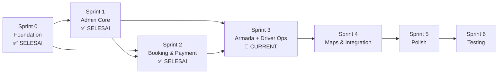

# Singgalang Jaya Travel — Sprint Planning & Pembagian Kerja

## Tim Pengembang

| Nama | Kode |
|------|------|
| Rayhan | RYH |
| Rayfo | RYF |
| Nayasha | NYS |
| Kevin | KVN |

---

## Status Saat Ini

### ✅ Sudah Selesai (Sprint 0 — Foundation)

| Item | Status |
|------|--------|
| Setup Laravel 13 | ✅ |
| Install Livewire 4.3 | ✅ |
| Install Laravel Breeze (Blade) | ✅ |
| TailwindCSS + Vite + Alpine.js | ✅ |
| Database MySQL config | ✅ |
| Migration: `users` + 8 tabel operasional baru | ✅ |
| User model + 8 model operasional baru | ✅ |
| RoleMiddleware & registration | ✅ |
| Auth controllers & views (Breeze) | ✅ |
| Login redirect by role | ✅ |
| Route groups (admin.*, driver.*) | ✅ |
| Seeders (Admin, Driver, Rute) | ✅ |
| Profile page + edit | ✅ |
| Custom layouts (`layouts.public`, `layouts.admin`, `layouts.driver`) | ✅ |
| Custom components (sidebar-admin, sidebar-driver, status-badge, alert, card) | ✅ |
| Upgrade admin dashboard (proper layout) | ✅ |
| Upgrade driver dashboard (proper layout) | ✅ |

### ✅ Sudah Selesai (Sprint 1 — Admin Core)

| Item | PIC | Status |
|------|-----|--------|
| Admin Dashboard (statistik widget) | RYF | ✅ |
| Admin Rute CRUD | RYF | ✅ |
| Admin Jadwal CRUD + toggle | RYF | ✅ |
| Admin Driver CRUD + user account | NYS | ✅ |
| Landing Page (semua section) | RYH | ✅ |
| Jadwal Public View | RYH | ✅ |
| Admin Trip — Index + Create | KVN | ✅ |

### ✅ Sudah Selesai (Sprint 2 — Booking & Payment Flow)

| Item | PIC | Status |
|------|-----|--------|
| Booking Form (create) — requires auth | RYH | ✅ |
| Booking Store + kode booking (`BookingService`) | RYH | ✅ |
| Booking Review page | RYH | ✅ |
| Edit Booking (lokasi jemput) | RYH | ✅ |
| Cancel Booking (pelanggan) | RYH | ✅ |
| Payment Page + Upload DP | RYH | ✅ |
| API Jadwal (AJAX: `jadwal.available`, `jadwal.checkKuota`) | RYH | ✅ |
| Cek Status Booking (`CekBookingController`) | RYH | ✅ |
| Map Picker component (`map-picker.blade.php`) | RYH | ✅ |
| BookingForm Livewire (auto-calculate tarif) | RYH | ✅ |
| Admin Booking Management (index + show + cancel) | NYS | ✅ |
| Admin Pembayaran Verification (index + show + verify + reject) | NYS | ✅ |
| BookingTable Livewire (search/filter) | NYS | ✅ |
| PembayaranTable Livewire (search/filter) | NYS | ✅ |
| Admin Trip — Show + Assign + Remove booking | KVN | ✅ |
| FonnteService (WhatsApp API) | RYH | ✅ |

### 🔲 Belum Dikerjakan

- Driver Dashboard (controller + proper view)
- Driver Trip operations (TripController, start/pickup/dropoff/complete)
- Driver Konfirmasi Pelunasan
- Map Viewer (driver + admin trip)
- Admin Laporan + Export
- Status booking auto-update (observer/listener)
- WhatsApp scheduler (konfirmasi pagi hari)
- Responsive polish sisa halaman (admin/driver panel)

---

## Pembagian Fitur Per Anggota

### Rayhan (RYH) — Customer Interface

| Modul | Routes | Views | Status |
|-------|:------:|:-----:|:------:|
| Landing Page | 1 | 1 | ✅ |
| Jadwal Public | 1 | 1 | ✅ |
| Booking Flow (create, store, review) | 3 | 3 | ✅ |
| Edit Booking (lokasi jemput) | 2 | 1 | ✅ |
| Cancel Booking (pelanggan) | 1 | — | ✅ |
| Pembayaran Customer | 2 | 1 | ✅ |
| Cek Status Booking | 2 | 2 | ✅ |
| Booking Saya (list + detail) | 2 | 2 | ✅ |
| API (AJAX) | 2 | — | ✅ |
| Layout Public | — | 1 | ✅ |
| Map Picker component | — | 1 | ✅ |
| FonnteService | — | — | ✅ |

### Rayfo (RYF) — Admin Core

| Modul | Routes | Views | Status |
|-------|:------:|:-----:|:------:|
| Admin Dashboard | 1 | 1 | ✅ |
| Admin Layout + Sidebar | — | 2 | ✅ |
| Admin Rute CRUD | 6 | 3 | ✅ |
| Admin Armada CRUD | 6 | 3 | ✅ |
| Admin Jadwal CRUD | 7 | 3 | ✅ |
| Admin Laporan | 2 | 1 | 🔲 |

### Nayasha (NYS) — Auth (✅done) + Admin Operasional

| Modul | Routes | Views | Status |
|-------|:------:|:-----:|:------:|
| Auth (Breeze) | — | — | ✅ |
| Admin Booking Mgmt | 3 | 2 | ✅ |
| Admin Pembayaran | 4 | 2 | ✅ |
| Admin Driver CRUD | 7 | 4 | ✅ |
| BookingTable Livewire | — | 1 | ✅ |
| PembayaranTable Livewire | — | 1 | ✅ |
| Custom Components (status-badge, alert) | — | 2 | ✅ |

### Kevin (KVN) — Trip & Driver Operations

| Modul | Routes | Views | Status |
|-------|:------:|:-----:|:------:|
| Admin Trip Mgmt (CRUD + assign + remove) | 8 | 3 | ✅ |
| Driver Layout + Sidebar | — | 2 | ✅ |
| Driver Dashboard (controller + proper view) | 1 | 1 | 🔲 |
| Driver Trip & Manifest | 2 | 2 | 🔲 |
| Driver Operations (start/pickup/dropoff/complete) | 4 | — | 🔲 |
| Driver Konfirmasi Pelunasan | 1 | — | 🔲 |
| Map Viewer components | — | 2 | 🔲 |

---

## Sprint Planning (Updated)

### Sprint 0 — Foundation ✅ SELESAI

Semua tugas fondasi telah diselesaikan: Setup project, Breeze auth, RoleMiddleware, route groups, migrations, models, seeders, layouts, custom components, dashboard admin & driver.

**Pembagian Migration**:

| PIC | Migration | Status |
|-----|-----------|--------|
| RYF | `create_armada_table` | ✅ Selesai |
| NYS | `create_drivers_table` (update: tambah `armada_id`) | ✅ Selesai |
| RYF | `create_rute_table`, `create_jadwal_table` | ✅ Selesai |
| RYH | `create_pelanggan_table`, `create_bookings_table`, `create_pembayaran_table` | ✅ Selesai |
| KVN | `create_trips_table` (update: tambah `armada_id`), `create_detail_trip_table` | ✅ Selesai |
| RYH | `create_whatsapp_notifications_table` | ✅ Selesai |

---

### Sprint 1 — Admin Core (Rute, Jadwal, Driver) ✅ SELESAI

**Durasi**: 5 hari

| Task | PIC | Status |
|------|-----|--------|
| Admin Dashboard (statistik widget) | RYF | ✅ |
| Admin Rute CRUD | RYF | ✅ 6 routes, 3 views |
| Admin Jadwal CRUD + toggle | RYF | ✅ 7 routes, 3 views |
| Admin Driver CRUD + user account | NYS | ✅ 7 routes, 1 view (full CRUD via modal) |
| Landing Page (semua section) | RYH | ✅ |
| Jadwal Public View | RYH | ✅ |
| Admin Trip — Index + Create | KVN | ✅ |

**Livewire**: Tidak digunakan (tabel driver menggunakan Blade + query params search/filter)

**File yang sudah dibuat**:
- `Admin\RuteController` + Form Requests + 3 views
- `Admin\JadwalController` + Form Requests + 3 views
- `Admin\DriverController` + Form Requests + 1 view (index with modals)
- `Admin\TripController` + Form Request + 3 views (index, create, show)
- `HomeController` + `public/home.blade.php`
- `JadwalPublicController` + `public/jadwal/index.blade.php`
- `RuteSeeder`, `DriverSeeder`

---

### Sprint 2 — Booking & Payment Flow ✅ SELESAI

**Durasi**: 5 hari

| Task | PIC | Status |
|------|-----|--------|
| Booking Form (create) — requires auth | RYH | ✅ |
| Booking Store + kode booking | RYH | ✅ |
| Booking Review | RYH | ✅ |
| Edit Booking (lokasi jemput) | RYH | ✅ |
| Cancel Booking (pelanggan) | RYH | ✅ |
| Payment Page + Upload DP | RYH | ✅ |
| Cek Status Booking | RYH | ✅ |
| API Jadwal (AJAX) | RYH | ✅ |
| Map Picker (Leaflet) | RYH | ✅ |
| Admin Booking Management | NYS | ✅ |
| Admin Pembayaran Verification | NYS | ✅ |
| Admin Trip — Show + Assign booking | KVN | ✅ |

**Livewire**: `BookingForm` ✅, `BookingTable` ✅, `PembayaranTable` ✅

**Services**: `BookingService` ✅, `FonnteService` ✅

**File yang sudah dibuat**:
- `BookingController` (public) — create, store, review, edit, update, cancel
- `PembayaranController` (public) — show, store
- `CekBookingController` — index, show
- `Admin\BookingController` — index, show, cancel
- `Admin\PembayaranController` — index, show, verify, reject
- `Livewire\BookingForm`, `Livewire\Admin\BookingTable`, `Livewire\Admin\PembayaranTable`
- `Services\BookingService`, `Services\FonnteService`
- Views: `public/booking/` (create, review, edit), `public/pembayaran/show`, `public/cek-booking/` (index, show)
- Views: `admin/bookings/` (index, show), `admin/pembayaran/` (index)
- Component: `map-picker.blade.php`
- Form Requests: `StoreBookingRequest`, `StorePembayaranRequest`, `CekBookingRequest`, `SearchJadwalRequest`

**Catatan**:
- Pelanggan WAJIB login untuk booking.
- DP flat Rp50.000 per booking (TIDAK ada timer 30 menit).
- Tidak ada konsep token booking.

---

### Sprint 3 — Armada + Driver Operations & Trip [/] SEDANG BERJALAN

**Durasi**: 5 hari

> ⚠️ Sprint ini mencakup perubahan keputusan final: tabel armada terpisah.

| Task | PIC | Routes | Status |
|------|-----|--------|--------|
| Migration `create_armada_table` | RYF | — | ✅ |
| Update migration `drivers` (tambah `armada_id`) | NYS | — | ✅ |
| Update migration `trips` (tambah `armada_id`) | KVN | — | ✅ |
| Admin Armada CRUD | RYF | 6 routes | ✅ |
| Update Admin Driver (link ke armada) | NYS | Update existing | ✅ |
| Booking Saya (list + detail, pengganti Cek Booking) | RYH | 2 routes | ✅ |
| Driver Dashboard (controller + proper view) | KVN | `driver.dashboard` | 🔲 |
| Driver Trip List + Detail/Manifest | KVN | 2 routes | 🔲 |
| Driver Start Trip | KVN | `driver.trips.start` | 🔲 |
| Driver Pickup Penumpang | KVN | `driver.trips.pickup` | 🔲 |
| Driver Dropoff Penumpang | KVN | `driver.trips.dropoff` | 🔲 |
| Driver Complete Trip | KVN | `driver.trips.complete` | 🔲 |
| Driver Konfirmasi Pelunasan | KVN | `driver.trips.confirmPayment` | 🔲 |
| Admin Laporan | RYF | 2 routes | 🔲 |
| Status booking auto-update | NYS | Observer/listener logic | 🔲 |
| WhatsApp Booking Notifications (DP verified & Trip assigned) | RYH | — | ✅ |
| Login & Register Responsive UI Polish | RYH | — | ✅ |
| Role-Specific Profile Customization (Admin, Driver, Pelanggan) | NYS/RYH | — | ✅ |
| Single-Pin Map Picker & Hidden Coordinates | RYH | — | ✅ |
| Admin DP Payment Proof Image Fix (Storage Link) | NYS | — | ✅ |

**Livewire**: `ArmadaTable` (optional), `TripManifest` (driver — interaktif pickup/dropoff + konfirmasi pelunasan)

**Deliverable**: Armada CRUD berfungsi. Driver bisa operasikan trip penuh + konfirmasi pelunasan. Admin laporan tersedia.

---

### Sprint 4 — Maps & Integration

**Durasi**: 4 hari

| Task | PIC | Keterangan | Status |
|------|-----|------------|--------|
| Leaflet map viewer (driver) | KVN | Lihat semua titik jemput/antar | 🔲 |
| Leaflet map viewer (admin trip) | KVN | Lihat distribusi penumpang | 🔲 |
| WA konfirmasi pagi keberangkatan | RYH | Scheduler command `dailyAt('06:00')` | 🔲 |
| WA notifikasi cancel booking | RYH | Event-driven via FonnteService | 🔲 |
| Admin laporan export | RYF | Export PDF/Excel | 🔲 |
| Notification bell (admin) | RYF | Count pending items | 🔲 |

> **Note**: Map Picker sudah selesai di Sprint 2. FonnteService sudah dibuat.

**Deliverable**: Map viewer terintegrasi. FonnteAPI WhatsApp berfungsi. Laporan bisa export.

---

### Sprint 5 — Polish & Responsive

**Durasi**: 4 hari

| Task | PIC | Keterangan |
|------|-----|------------|
| Responsive landing page | RYH | Mobile + tablet |
| Responsive admin sidebar (hamburger) | RYF | Mobile drawer |
| Responsive driver panel | KVN | Mobile-friendly manifest |
| Responsive forms & tables | NYS | Horizontal scroll, stack cards |
| Form validation (semua form) | Semua | Server-side + client-side |
| Error handling & flash messages | Semua | Alert component |
| UI polish (Poppins font, spacing, shadows) | Semua | Sesuai design rules |
| Loading states | Semua | Button loading, Livewire loading |

**Deliverable**: Seluruh halaman responsive. UI production-ready.

---

### Sprint 6 — Testing & Deployment

**Durasi**: 3 hari

| Task | PIC | Keterangan |
|------|-----|------------|
| Testing alur booking end-to-end | RYH + NYS | Customer → Admin verify |
| Testing alur trip end-to-end | KVN + RYF | Admin create trip → Driver selesai |
| Testing driver konfirmasi pelunasan | KVN | Driver → Pelanggan bayar → Konfirmasi |
| Cross-browser testing | Semua | Chrome, Firefox, Mobile |
| Bug fixing | Semua | Fix issues |
| Seed production data | RYF | Rute, armada, admin account |
| Documentation | Semua | README update |
| Final review | Semua | Code review, cleanup |

**Deliverable**: Sistem siap demo/deploy.

---

## Timeline Summary

```
Sprint 0 ████████████████░░░░░░░░░░ (3 hari)  Foundation ✅ SELESAI
Sprint 1 ████████████████░░░░░░░░░░ (5 hari)  Admin Core ✅ SELESAI
Sprint 2 ████████████████░░░░░░░░░░ (5 hari)  Booking & Payment ✅ SELESAI
Sprint 3 ░░░░░░░░░░░░░░░░██████░░░░ (5 hari)  Armada + Driver Ops ← CURRENT
Sprint 4 ░░░░░░░░░░░░░░░░░░░░██░░░░ (4 hari)  Maps & Integration
Sprint 5 ░░░░░░░░░░░░░░░░░░░░░░██░░ (4 hari)  Polish & Responsive
Sprint 6 ░░░░░░░░░░░░░░░░░░░░░░░░██ (3 hari)  Testing & Deploy
─────────────────────────────────────────────
Total: 29 hari kerja (~6 minggu)
Progress: Sprint 0-2 selesai, Sprint 3 sebagian selesai (16/29 hari = ~55%)
```

---

## Dependency Graph



---

## Inventaris File Yang Sudah Ada

### Controllers

| File | PIC | Status |
|------|-----|--------|
| `app/Http/Controllers/HomeController.php` | RYH | ✅ |
| `app/Http/Controllers/BookingController.php` | RYH | ✅ |
| `app/Http/Controllers/PembayaranController.php` | RYH | ✅ |
| `app/Http/Controllers/CekBookingController.php` | RYH | ✅ |
| `app/Http/Controllers/JadwalPublicController.php` | RYH | ✅ |
| `app/Http/Controllers/ProfileController.php` | Semua | ✅ |
| `app/Http/Controllers/Admin/DashboardController.php` | RYF | ✅ |
| `app/Http/Controllers/Admin/RuteController.php` | RYF | ✅ |
| `app/Http/Controllers/Admin/JadwalController.php` | RYF | ✅ |
| `app/Http/Controllers/Admin/BookingController.php` | NYS | ✅ |
| `app/Http/Controllers/Admin/PembayaranController.php` | NYS | ✅ |
| `app/Http/Controllers/Admin/DriverController.php` | NYS | ✅ |
| `app/Http/Controllers/Admin/TripController.php` | KVN | ✅ |
| `app/Http/Controllers/Admin/ArmadaController.php` | RYF | ✅ |
| `app/Http/Controllers/Admin/LaporanController.php` | RYF | 🔲 |
| `app/Http/Controllers/Driver/DashboardController.php` | KVN | 🔲 |
| `app/Http/Controllers/Driver/TripController.php` | KVN | 🔲 |

### Livewire

| File | PIC | Status |
|------|-----|--------|
| `app/Livewire/BookingForm.php` | RYH | ✅ |
| `app/Livewire/Admin/BookingTable.php` | NYS | ✅ |
| `app/Livewire/Admin/PembayaranTable.php` | NYS | ✅ |
| `app/Livewire/Admin/ArmadaTable.php` | RYF | ❌ (Tidak diperlukan, CRUD menggunakan modal) |
| `app/Livewire/Driver/TripManifest.php` | KVN | 🔲 |

### Services

| File | PIC | Status |
|------|-----|--------|
| `app/Services/BookingService.php` | RYH | ✅ |
| `app/Services/FonnteService.php` | RYH | ✅ |
| `app/Services/BookingWhatsappNotificationService.php` | RYH | ✅ |

### Views (Blade)

| Folder/File | PIC | Status |
|-------------|-----|--------|
| `resources/views/public/home.blade.php` | RYH | ✅ |
| `resources/views/public/jadwal/index.blade.php` | RYH | ✅ |
| `resources/views/public/booking/create.blade.php` | RYH | ✅ |
| `resources/views/public/booking/review.blade.php` | RYH | ✅ |
| `resources/views/public/booking/edit.blade.php` | RYH | ✅ |
| `resources/views/public/pembayaran/show.blade.php` | RYH | ✅ |
| `resources/views/public/cek-booking/index.blade.php` | RYH | ✅ |
| `resources/views/public/cek-booking/show.blade.php` | RYH | ✅ |
| `resources/views/public/booking/index.blade.php` | RYH | ✅ |
| `resources/views/public/booking/show.blade.php` | RYH | ✅ |
| `resources/views/admin/dashboard.blade.php` | RYF | ✅ |
| `resources/views/admin/rute/*` (3 files) | RYF | ✅ |
| `resources/views/admin/jadwal/*` (3 files) | RYF | ✅ |
| `resources/views/admin/armada/*` | RYF | ✅ (index.blade.php modal CRUD) |
| `resources/views/admin/laporan/*` | RYF | 🔲 |
| `resources/views/admin/bookings/index.blade.php` | NYS | ✅ |
| `resources/views/admin/bookings/show.blade.php` | NYS | ✅ |
| `resources/views/admin/pembayaran/index.blade.php` | NYS | ✅ |
| `resources/views/admin/drivers/index.blade.php` | NYS | ✅ |
| `resources/views/admin/trips/index.blade.php` | KVN | ✅ |
| `resources/views/admin/trips/create.blade.php` | KVN | ✅ |
| `resources/views/admin/trips/show.blade.php` | KVN | ✅ |
| `resources/views/driver/dashboard.blade.php` | KVN | ⚠️ Placeholder |
| `resources/views/driver/trips/*` | KVN | 🔲 |
| `resources/views/components/map-picker.blade.php` | RYH | ✅ |
| `resources/views/components/map-viewer.blade.php` | KVN | 🔲 |
| `resources/views/livewire/booking-form.blade.php` | RYH | ✅ |
| `resources/views/livewire/admin/booking-table.blade.php` | NYS | ✅ |
| `resources/views/livewire/admin/pembayaran-table.blade.php` | NYS | ✅ |
| `resources/views/profile/admin-edit.blade.php` | NYS | ✅ |
| `resources/views/profile/driver-edit.blade.php` | NYS | ✅ |
| `resources/views/profile/public-edit.blade.php` | RYH | ✅ |
| `resources/views/profile/partials/profile-page-content.blade.php` | NYS/RYH | ✅ |

> **Next step**: Selesaikan Sprint 3 — Driver Dashboard & operations (Kevin), Admin Laporan (Rayfo), Status booking auto-update (Nayasha).
