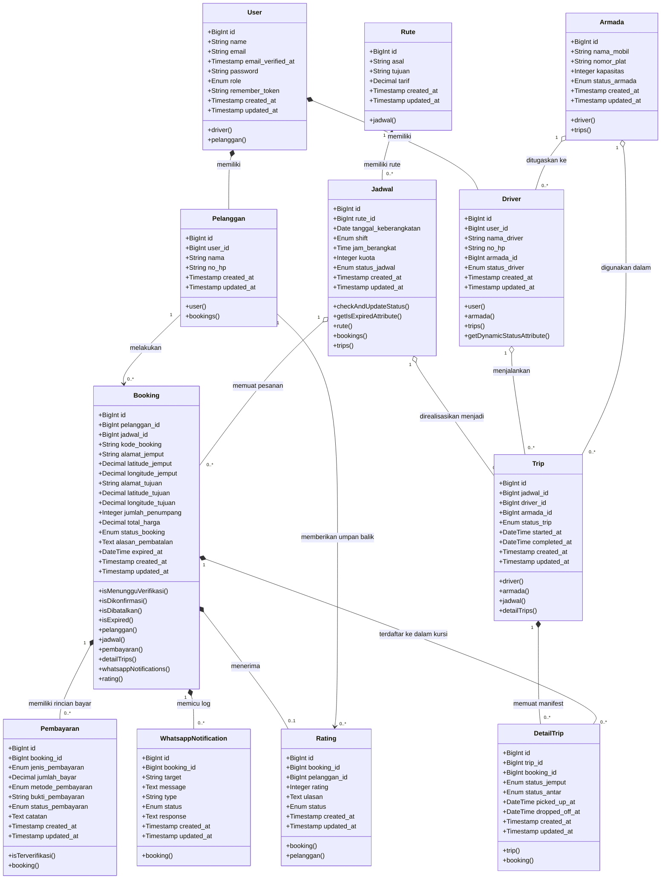

# Class Diagram - Sistem Informasi Singgalang Jaya Travel

Diagram kelas (Class Diagram) berikut menampilkan seluruh kelengkapan entitas sistem:
1. **Atribut Lengkap** (Semua field database termasuk Primary Key, Foreign Key, dan Timestamps).
2. **Operasi (Method)** menampilkan perilaku model dan fungsi pemanggilan relasi antar kelas.
3. **Relasi** menggunakan notasi UML yang sesuai (**Composition**, **Aggregation**, dan **Association**).

