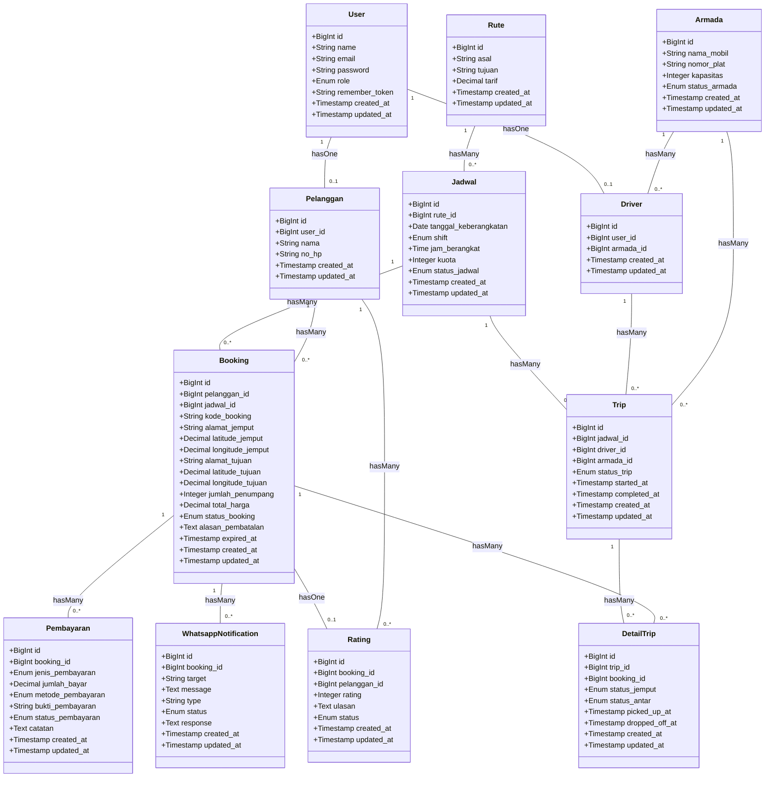

# Class Diagram - Sistem Informasi Singgalang Jaya Travel

Diagram kelas (Class Diagram) berikut dihasilkan berdasarkan implementasi nyata struktur *Database* dan *Model Relations* (Eloquent) pada proyek Laravel Singgalang Jaya Travel.

