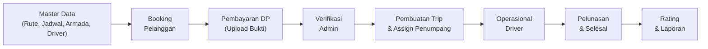
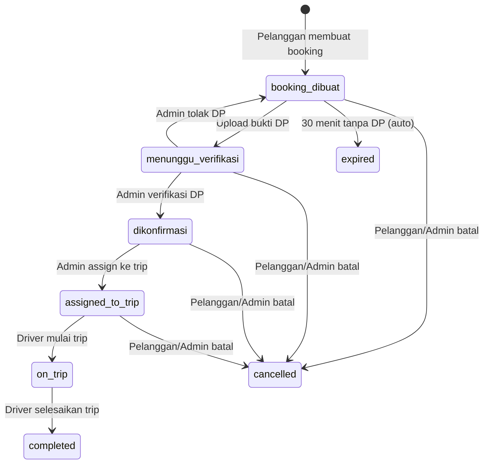
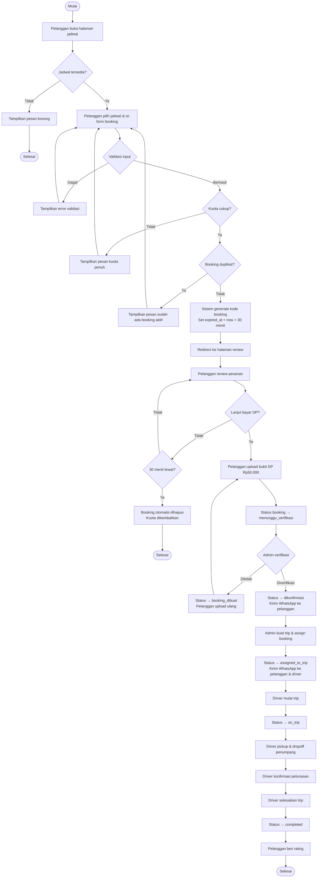
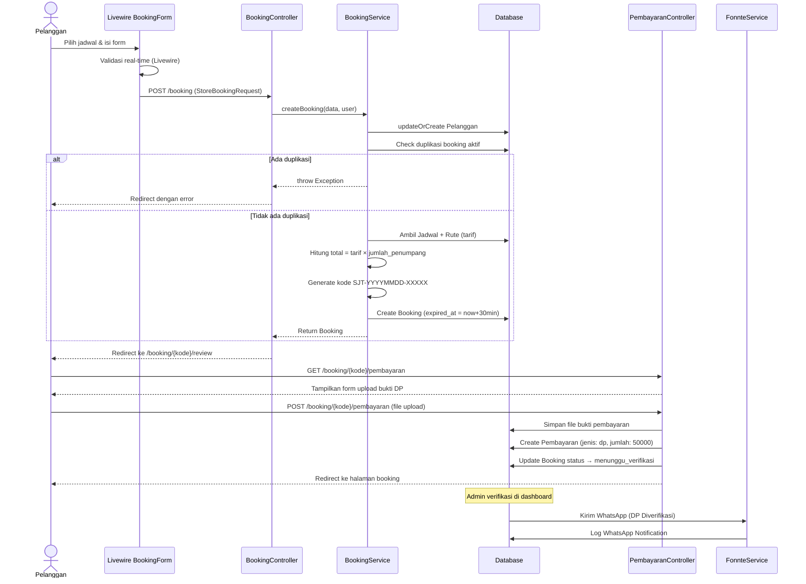
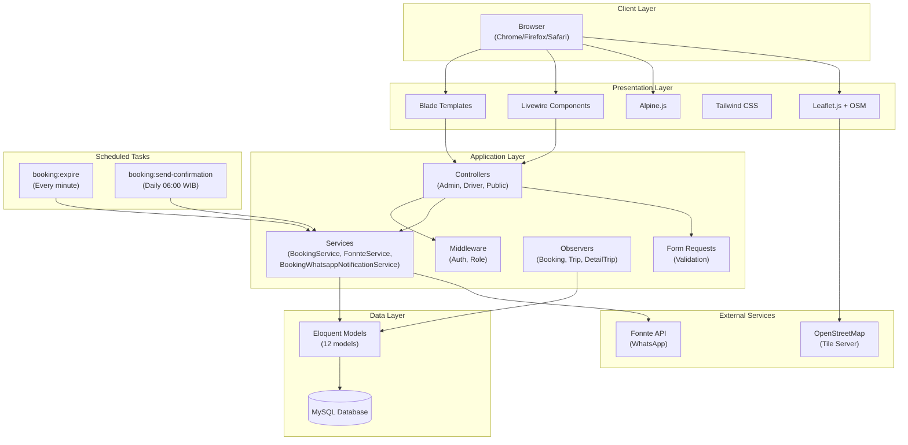

# Kesimpulan Project Singgalang Jaya Travel System — Pedoman SRS

> [!NOTE]
> Dokumen ini merangkum seluruh aspek teknis dan fungsional dari project **Singgalang Jaya Travel System** berdasarkan analisis kode sumber, model database, routes, controllers, services, dan tests. Setiap bagian dipetakan langsung ke struktur SRS yang diminta.

---

## 1. Pendahuluan

### 1.1 Tujuan

Sistem ini bertujuan untuk **mendigitalisasi operasional travel antar kota** pada perusahaan Singgalang Jaya Travel. Secara spesifik:

- **Pelanggan**: Dapat melakukan booking travel secara online, upload bukti pembayaran DP, memantau status booking, dan membatalkan booking secara mandiri.
- **Admin**: Dapat mengelola master data (rute, jadwal, armada, driver), memverifikasi pembayaran, membuat trip, assign penumpang ke trip, serta melihat laporan operasional.
- **Driver**: Dapat melihat manifest penumpang, melakukan pickup/dropoff, mengkonfirmasi pelunasan, dan menyelesaikan trip.

Sistem dikembangkan sebagai luaran **Project Based Learning (PBL)** serta **UAS mata kuliah Konstruksi Evolusi Perangkat Lunak**.

### 1.2 Konvensi Dokumen

| Aspek | Konvensi |
|-------|----------|
| Bahasa kode | PHP 8.3+ dengan Laravel 13 |
| Penamaan database | Bahasa Indonesia (singular): `rute`, `jadwal`, `armada`, `pelanggan`, `pembayaran`, `detail_trip` |
| Penamaan kolom enum | Snake case: `status_booking`, `status_jadwal`, `status_trip`, `status_pembayaran` |
| Format kode booking | `SJT-{YYYYMMDD}-{RANDOM5}` (contoh: `SJT-20260707-A3X9K`) |
| Mata uang | Rupiah (Rp), disimpan sebagai unsigned integer tanpa desimal |
| Zona waktu operasional | `Asia/Jakarta` (WIB) |
| Notifikasi | WhatsApp via Fonnte API |
| Peta/Geolocation | Leaflet.js + OpenStreetMap |

### 1.3 Audiens yang Dituju dan Saran Pembacaan

| Audiens | Bagian yang Relevan |
|---------|---------------------|
| **Pelanggan (End User)** | Bab 3.1 (Antarmuka Pengguna), Bab 4.2 (Fitur Sistem: Booking, Pembayaran, Cek Status) |
| **Admin Travel** | Bab 4.2 (Fitur Admin: CRUD Master Data, Verifikasi Pembayaran, Manajemen Trip, Laporan) |
| **Driver** | Bab 4.2 (Fitur Driver: Dashboard, Manifest, Pickup/Dropoff, Konfirmasi Pelunasan) |
| **Tim Pengembang** | Bab 2 (Deskripsi Umum), Bab 3 (Antarmuka), Bab 5 (Non-Fungsional) |
| **Dosen/Pembimbing PBL** | Seluruh dokumen, terutama Bab 1, Bab 2, Bab 4 |

### 1.4 Batasan Produk

1. **Hanya layanan travel antar kota** — Tidak mencakup layanan rental kendaraan, pengiriman barang, atau travel antar provinsi.
2. **Pembayaran DP flat Rp50.000** — Tidak mendukung variasi nominal DP. Pelunasan sisa dilakukan langsung ke driver saat trip.
3. **Satu rute per booking** — Pelanggan tidak dapat memesan multi-rute dalam satu transaksi.
4. **Tidak ada payment gateway terintegrasi** — Pembayaran dilakukan via transfer manual, bukti upload ke sistem, dan diverifikasi oleh admin.
5. **Notifikasi hanya via WhatsApp** — Tidak menggunakan email atau push notification.
6. **Tidak ada fitur real-time tracking** — Peta hanya digunakan untuk menentukan titik jemput/antar, bukan tracking kendaraan secara live.
7. **Batas waktu pembayaran DP 30 menit** — Booking otomatis expired jika DP tidak dibayar dalam 30 menit.
8. **Jadwal menggunakan sistem shift** — Hanya dua shift tersedia: `pagi` dan `malam`.
9. **Single tenant** — Sistem dirancang khusus untuk satu perusahaan travel (Singgalang Jaya).

### 1.5 Ruang Lingkup Produk

Ruang lingkup mencakup seluruh siklus operasional travel:



**Fitur yang termasuk:**
- Registrasi dan autentikasi multi-role (Pelanggan, Admin, Driver)
- Landing page publik dengan jadwal keberangkatan dan testimonial
- Booking travel online dengan pemilihan jadwal, titik jemput/antar via peta
- Pembayaran DP dengan upload bukti dan verifikasi admin
- Manajemen trip (buat trip, assign booking, manifest penumpang)
- Dashboard driver (pickup, dropoff, konfirmasi pelunasan, selesai trip)
- Notifikasi WhatsApp otomatis (konfirmasi keberangkatan harian, pembatalan, verifikasi DP, assign trip)
- Laporan booking, trip, dan pendapatan dengan export
- Sistem rating dan ulasan pelanggan
- Cek status booking publik (tanpa login)
- Auto-expiration booking (30 menit tanpa DP)
- Scheduled command untuk konfirmasi keberangkatan harian (jam 06:00 WIB)

### 1.6 Referensi

| Referensi | Keterangan |
|-----------|------------|
| Laravel 13 Documentation | Framework backend utama |
| Livewire 4.3 Documentation | Komponen interaktif (BookingForm) |
| Tailwind CSS v3 Documentation | Framework CSS untuk styling |
| Alpine.js v3 Documentation | Framework JavaScript ringan untuk interaktivitas frontend |
| Vite 8 Documentation | Build tool dan dev server frontend |
| Fonnte API Documentation | Integrasi WhatsApp notification |
| Leaflet.js Documentation | Library peta interaktif |
| OpenStreetMap | Tile server untuk peta |
| Laravel Breeze v2.4 | Authentication scaffolding |
| IEEE 830-1998 | Standar format SRS |

---

## 2. Deskripsi Umum

### 2.1 Perspektif Produk

Singgalang Jaya Travel System adalah **aplikasi web standalone** yang menggantikan proses manual pemesanan travel antar kota. Sistem ini bukan merupakan bagian dari sistem yang lebih besar, namun terintegrasi dengan:

- **Fonnte API** — Layanan pihak ketiga untuk pengiriman pesan WhatsApp otomatis
- **OpenStreetMap + Leaflet.js** — Layanan peta publik untuk geolocation titik jemput/antar

Sistem diakses melalui **web browser** dan bersifat **server-side rendered** menggunakan Blade template engine dengan komponen interaktif Livewire dan Alpine.js.

### 2.2 Fungsi Produk

| No | Fungsi Utama | Aktor | Deskripsi |
|----|-------------|-------|-----------|
| F01 | Registrasi & Login | Pelanggan | Mendaftar akun dan login ke sistem |
| F02 | Lihat Jadwal Keberangkatan | Publik | Melihat jadwal yang tersedia tanpa login |
| F03 | Cek Status Booking | Publik | Mengecek status booking via kode booking |
| F04 | Buat Booking | Pelanggan | Memilih jadwal, isi data jemput/antar, buat pesanan |
| F05 | Upload Bukti DP | Pelanggan | Upload bukti transfer DP Rp50.000 |
| F06 | Lihat Booking Saya | Pelanggan | Melihat daftar booking aktif dan riwayat |
| F07 | Edit Lokasi | Pelanggan | Mengubah alamat jemput (sebelum assigned to trip) |
| F08 | Batalkan Booking | Pelanggan | Membatalkan booking dengan alasan |
| F09 | Rating & Ulasan | Pelanggan | Memberikan rating (1-5) dan ulasan setelah trip selesai |
| F10 | Kelola Rute | Admin | CRUD data rute (asal, tujuan, tarif) |
| F11 | Kelola Armada | Admin | CRUD data armada (nama mobil, plat, kapasitas) |
| F12 | Kelola Driver | Admin | CRUD data driver (beserta akun user) |
| F13 | Kelola Jadwal | Admin | CRUD jadwal keberangkatan, toggle aktif/nonaktif |
| F14 | Verifikasi Pembayaran | Admin | Verifikasi atau tolak bukti pembayaran DP |
| F15 | Kelola Booking | Admin | Lihat daftar booking, batalkan booking |
| F16 | Kelola Trip | Admin | Buat trip, assign booking ke trip, hapus booking dari trip |
| F17 | Kelola Rating | Admin | Publish, sembunyikan, atau hapus rating |
| F18 | Laporan | Admin | Laporan booking, trip, pendapatan dengan export |
| F19 | Dashboard Driver | Driver | Melihat statistik trip hari ini |
| F20 | Manifest Penumpang | Driver | Melihat daftar penumpang per trip |
| F21 | Pickup & Dropoff | Driver | Update status jemput dan antar penumpang |
| F22 | Konfirmasi Pelunasan | Driver | Konfirmasi pelunasan sisa pembayaran dari pelanggan |
| F23 | Selesaikan Trip | Driver | Menandai trip sebagai selesai |
| F24 | Notifikasi WhatsApp | Sistem | Kirim notifikasi otomatis via WhatsApp |
| F25 | Auto-expire Booking | Sistem | Booking otomatis expired setelah 30 menit tanpa DP |

### 2.3 Kelas dan Karakteristik Pengguna

| Kelas Pengguna | Level Teknis | Frekuensi Penggunaan | Hak Akses |
|----------------|-------------|---------------------|-----------|
| **Pelanggan** | Rendah-Menengah (end user umum) | Sesekali (saat perlu travel) | Register, login, booking, upload pembayaran, lihat status, batal, rating |
| **Admin** | Menengah (staf operasional) | Harian | Full access: CRUD master data, verifikasi pembayaran, kelola trip, laporan |
| **Driver** | Rendah (pengemudi) | Harian (saat ada trip) | Lihat dashboard, manifest, pickup, dropoff, konfirmasi pelunasan, selesaikan trip |
| **Publik (Guest)** | Rendah | Sesekali | Lihat jadwal, cek booking |

### 2.4 Lingkungan Operasi

| Komponen | Spesifikasi |
|----------|-------------|
| **Server OS** | Linux/Windows (mendukung PHP 8.3+) |
| **Web Server** | Apache atau Nginx |
| **Backend Runtime** | PHP ≥ 8.3 |
| **Backend Framework** | Laravel 13.x |
| **Database** | MySQL 8.x |
| **Frontend** | Blade + Livewire 4.3 + Alpine.js 3.x + Tailwind CSS 3.x |
| **Build Tool** | Vite 8.x, Node.js 18+ |
| **Queue Driver** | Database |
| **Cache/Session** | Database |
| **File Storage** | Local filesystem (public disk) |
| **Browser Support** | Chrome, Firefox, Safari, Edge (versi modern) |
| **Koneksi Internet** | Diperlukan untuk Fonnte API dan OpenStreetMap tiles |

### 2.5 Batasan Desain dan Implementasi

1. **Framework wajib Laravel 13** — Seluruh backend menggunakan Laravel 13 dengan Blade sebagai template engine.
2. **Autentikasi via Laravel Breeze** — Tidak menggunakan custom auth atau Jetstream/Fortify.
3. **Tidak menggunakan SPA** — Arsitektur server-side rendered (SSR) dengan interaktivitas tambahan via Livewire dan Alpine.js.
4. **Database relasional MySQL** — Tidak menggunakan NoSQL atau multi-database.
5. **Queue berbasis database** — Tidak menggunakan Redis, SQS, atau queue server terpisah.
6. **Geolocation hanya untuk titik jemput/antar** — Bukan real-time tracking.
7. **Tanpa API REST publik** — Sistem hanya diakses via web browser, tidak menyediakan API untuk konsumsi pihak ketiga.
8. **Satu bahasa (Indonesia)** — Tidak mendukung multi-bahasa/i18n.
9. **Deployment target: shared hosting atau VPS** — Tidak didesain untuk container/Kubernetes.

### 2.6 Dokumentasi Pengguna

Dokumentasi yang tersedia dalam project:

| Dokumen | Lokasi | Keterangan |
|---------|--------|------------|
| README.md | `/README.md` | Panduan setup cepat dan gambaran umum |
| Installation Guide | `/docs/INSTALLATION.MD` | Panduan instalasi lengkap |
| Feature Documentation | `/docs/features.md` | Dokumentasi fitur detail |
| Dependencies | `/docs/dependencies.md` | Daftar dan penjelasan dependency |
| Changelog | `/docs/CHANGELOG.MD` | Catatan perubahan per versi |
| GitHub Roles | `/docs/github-roles.md` | Pembagian peran tim dalam GitHub |
| GitHub Actions | `/docs/github-actions.md` | Dokumentasi CI/CD |
| Refactoring | `/docs/refactoring.md` | Catatan refactoring |
| Statement Coverage | `/docs/statemen-coverage.md` | Laporan coverage testing |

### 2.7 Asumsi dan Ketergantungan

**Asumsi:**
1. Pelanggan memiliki akses internet dan browser modern.
2. Pelanggan memiliki akun WhatsApp aktif untuk menerima notifikasi.
3. Admin melakukan verifikasi pembayaran secara manual (memeriksa bukti transfer).
4. Satu driver dialokasikan ke satu armada (relasi 1:1).
5. Tarif per rute bersifat tetap dan seragam untuk semua penumpang.
6. DP flat Rp50.000 berlaku untuk semua booking, tidak bergantung jumlah penumpang atau rute.

**Ketergantungan:**
1. **Fonnte API** — Untuk pengiriman notifikasi WhatsApp. Jika API down, notifikasi gagal tetapi fungsionalitas booking tetap berjalan (graceful degradation).
2. **OpenStreetMap** — Untuk tile peta. Jika tidak tersedia, pemilihan lokasi via peta tidak berfungsi, namun input alamat manual tetap tersedia.
3. **MySQL** — Sebagai satu-satunya database yang didukung.
4. **Composer & npm** — Untuk manajemen dependency PHP dan JavaScript.

---

## 3. Persyaratan Antarmuka Eksternal

### 3.1 Antarmuka Pengguna

Sistem memiliki 4 kelompok antarmuka utama:

#### A. Halaman Publik (Guest/Pelanggan)
| Halaman | Route | Deskripsi |
|---------|-------|-----------|
| Landing Page | `/` | Halaman utama dengan hero section, fitur unggulan, dan carousel testimonial |
| Jadwal Keberangkatan | `/jadwal` | Pencarian dan filter jadwal travel aktif |
| Cek Booking | `/cek-booking` | Form input kode booking untuk cek status |

#### B. Halaman Pelanggan (Auth Required)
| Halaman | Route | Deskripsi |
|---------|-------|-----------|
| Form Booking | `/booking/create` | Form pembuatan booking dengan Livewire (BookingForm component) |
| Review Booking | `/booking/{kode}/review` | Halaman review sebelum bayar DP |
| Halaman Pembayaran | `/booking/{kode}/pembayaran` | Upload bukti pembayaran DP |
| Booking Saya | `/booking-saya` | Daftar booking aktif dan riwayat |
| Detail Booking | `/booking/{kode}` | Detail lengkap booking, status, rating |
| Edit Lokasi | `/booking/{kode}/edit` | Ubah alamat jemput/antar |

#### C. Dashboard Admin
| Halaman | Route | Deskripsi |
|---------|-------|-----------|
| Dashboard | `/admin/dashboard` | Ringkasan statistik sistem |
| Kelola Rute | `/admin/rute` | CRUD rute travel |
| Kelola Armada | `/admin/armada` | CRUD armada kendaraan |
| Kelola Driver | `/admin/drivers` | CRUD driver + akun user |
| Kelola Jadwal | `/admin/jadwal` | CRUD jadwal + toggle status |
| Kelola Booking | `/admin/bookings` | Lihat dan kelola booking |
| Kelola Pembayaran | `/admin/pembayaran` | Verifikasi/tolak pembayaran |
| Kelola Trip | `/admin/trips` | Buat trip, assign booking, manifest |
| Kelola Rating | `/admin/rating` | Publish/sembunyikan rating |
| Laporan | `/admin/laporan` | Laporan dengan export |

#### D. Dashboard Driver
| Halaman | Route | Deskripsi |
|---------|-------|-----------|
| Dashboard | `/driver/dashboard` | Statistik trip hari ini |
| Daftar Trip | `/driver/trips` | Daftar trip yang ditugaskan |
| Detail Trip | `/driver/trips/{trip}` | Manifest penumpang, aksi pickup/dropoff |

**Komponen UI utama:**
- **Peta interaktif** (Leaflet.js + OpenStreetMap) untuk titik jemput dan antar
- **Livewire BookingForm** untuk form booking interaktif (auto-load jadwal, kalkulasi harga)
- **Tailwind CSS** untuk responsive design di semua ukuran layar
- **Alpine.js** untuk interaktivitas frontend (modal, dropdown, toggle)

### 3.2 Antarmuka Perangkat Keras

| Perangkat | Persyaratan Minimum |
|-----------|-------------------|
| **Server** | CPU 2 core, RAM 2GB, SSD 20GB, akses internet |
| **Client (Desktop)** | Monitor ≥ 1024×768, keyboard, mouse |
| **Client (Mobile)** | Smartphone dengan browser modern dan koneksi internet |
| **Kamera/File Access** | Diperlukan untuk upload bukti pembayaran (foto/screenshot) |

### 3.3 Antarmuka Perangkat Lunak

| Software Eksternal | Versi | Antarmuka | Fungsi |
|-------------------|-------|-----------|--------|
| MySQL | 8.x | Eloquent ORM | Database relasional utama |
| Fonnte API | REST API | HTTP POST (Laravel Http Client) | Pengiriman pesan WhatsApp |
| OpenStreetMap | Tile Server | HTTP GET (Leaflet.js) | Peta interaktif |
| Laravel Breeze | 2.4 | PHP Package | Scaffolding autentikasi |
| Livewire | 4.3 | PHP Package | Komponen interaktif server-side |
| Vite | 8.x | Node.js | Asset bundling dan dev server |
| PHPUnit | 12.5 | PHP CLI | Testing framework |

### 3.4 Antarmuka Komunikasi

| Protokol | Penggunaan |
|----------|-----------|
| **HTTP/HTTPS** | Komunikasi utama antara browser dan server Laravel |
| **WebSocket (Livewire)** | Update real-time pada form booking (opsional, fallback ke polling) |
| **HTTPS REST** | Komunikasi dengan Fonnte API (`https://api.fonnte.com/send`) |
| **HTTP Tile** | Pengambilan tile peta dari OpenStreetMap |

**Konfigurasi Fonnte API:**
```
URL: https://api.fonnte.com/send
Auth: Token-based (header Authorization)
Method: POST (form data)
Country Code: 62 (Indonesia)
```

---

## 4. Functional Requirement

### 4.1 Use Case Diagram

Berdasarkan analisis kode, aktor dan use case yang teridentifikasi:

```mermaid
graph TB
    subgraph Aktor
        G["👤 Guest/Publik"]
        P["👤 Pelanggan"]
        A["👤 Admin"]
        D["👤 Driver"]
        S["⚙️ Sistem (Scheduler)"]
    end

    subgraph "Use Cases"
        UC01["UC01: Lihat Landing Page"]
        UC02["UC02: Lihat Jadwal"]
        UC03["UC03: Cek Status Booking"]
        UC04["UC04: Register"]
        UC05["UC05: Login/Logout"]
        UC06["UC06: Buat Booking"]
        UC07["UC07: Review Booking"]
        UC08["UC08: Upload Bukti DP"]
        UC09["UC09: Lihat Booking Saya"]
        UC10["UC10: Edit Lokasi/Penumpang"]
        UC11["UC11: Batalkan Booking"]
        UC12["UC12: Beri Rating"]
        UC13["UC13: Kelola Rute"]
        UC14["UC14: Kelola Armada"]
        UC15["UC15: Kelola Driver"]
        UC16["UC16: Kelola Jadwal"]
        UC17["UC17: Verifikasi Pembayaran"]
        UC18["UC18: Kelola Booking"]
        UC19["UC19: Kelola Trip"]
        UC20["UC20: Assign Booking ke Trip"]
        UC21["UC21: Kelola Rating"]
        UC22["UC22: Lihat Laporan"]
        UC23["UC23: Dashboard Driver"]
        UC24["UC24: Lihat Manifest"]
        UC25["UC25: Pickup Penumpang"]
        UC26["UC26: Dropoff Penumpang"]
        UC27["UC27: Konfirmasi Pelunasan"]
        UC28["UC28: Selesaikan Trip"]
        UC29["UC29: Auto-expire Booking"]
        UC30["UC30: Kirim Konfirmasi Harian"]
        UC31["UC31: Kelola Profil"]
    end

    G --> UC01 & UC02 & UC03
    P --> UC04 & UC05 & UC06 & UC07 & UC08 & UC09 & UC10 & UC11 & UC12 & UC31
    A --> UC05 & UC13 & UC14 & UC15 & UC16 & UC17 & UC18 & UC19 & UC20 & UC21 & UC22
    D --> UC05 & UC23 & UC24 & UC25 & UC26 & UC27 & UC28
    S --> UC29 & UC30
```



### 4.2 Fitur Sistem

#### 4.2.1 Deskripsi Sistem — Alur Bisnis Utama

**Alur Booking (Happy Path):**



**Status Booking (8 status):**
| Status | Kode | Deskripsi |
|--------|------|-----------|
| Booking Dibuat | `booking_dibuat` | Booking baru, menunggu upload DP |
| Menunggu Verifikasi | `menunggu_verifikasi` | Bukti DP telah diupload, menunggu verifikasi admin |
| Dikonfirmasi | `dikonfirmasi` | DP diverifikasi admin |
| Assigned to Trip | `assigned_to_trip` | Booking telah masuk ke trip |
| On Trip | `on_trip` | Trip sedang berlangsung |
| Completed | `completed` | Trip selesai |
| Cancelled | `cancelled` | Dibatalkan oleh pelanggan atau admin |
| Expired | `expired` | Otomatis expired (30 menit tanpa DP) |

**Status Trip (5 status):**
| Status | Kode | Deskripsi |
|--------|------|-----------|
| New | `new` | Trip baru dibuat |
| Ready | `ready` | Trip siap berangkat |
| On Trip | `on_trip` | Trip sedang berlangsung |
| Completed | `completed` | Trip selesai |
| Cancelled | `cancelled` | Trip dibatalkan |

**Status Pembayaran (3 status):**
| Status | Kode | Deskripsi |
|--------|------|-----------|
| Menunggu | `menunggu` | Menunggu verifikasi admin |
| Terverifikasi | `terverifikasi` | Telah diverifikasi admin |
| Ditolak | `ditolak` | Ditolak oleh admin |

#### 4.2.2 Urutan Stimulus/Respons

| No | Stimulus | Respons |
|----|----------|---------|
| SR01 | Pelanggan submit form booking | Sistem generate kode booking `SJT-{YYYYMMDD}-{RANDOM5}`, simpan booking dengan status `booking_dibuat`, set expired_at = now + 30 menit, redirect ke halaman review |
| SR02 | Pelanggan upload bukti DP | Sistem simpan file bukti, buat record pembayaran (jenis: dp, jumlah: 50000), ubah status booking ke `menunggu_verifikasi` |
| SR03 | Admin verifikasi DP | Sistem ubah status pembayaran ke `terverifikasi`, ubah status booking ke `dikonfirmasi`, kirim notifikasi WhatsApp ke pelanggan |
| SR04 | Admin tolak DP | Sistem ubah status pembayaran ke `ditolak`, kembalikan status booking ke `booking_dibuat`, reset expired_at |
| SR05 | Admin assign booking ke trip | Sistem buat record detail_trip, ubah status booking ke `assigned_to_trip`, kirim WhatsApp ke pelanggan & driver |
| SR06 | Driver mulai trip | Sistem ubah status trip ke `on_trip`, update semua booking terkait ke `on_trip` |
| SR07 | Driver pickup penumpang | Sistem update detail_trip: status_jemput = `sudah_dijemput`, catat waktu picked_up_at |
| SR08 | Driver dropoff penumpang | Sistem update detail_trip: status_antar = `sudah_diantar`, catat waktu dropped_off_at |
| SR09 | Driver konfirmasi pelunasan | Sistem buat record pembayaran (jenis: pelunasan, jumlah: sisa), status langsung `terverifikasi` |
| SR10 | Driver selesaikan trip | Sistem ubah status trip ke `completed`, semua booking terkait ke `completed`, catat completed_at |
| SR11 | Pelanggan batalkan booking | Sistem ubah status ke `cancelled`, simpan alasan, kirim WhatsApp ke admin dan driver (jika ada) |
| SR12 | Scheduler expire booking | Setiap menit, cek booking `booking_dibuat` yang expired_at sudah lewat, hapus booking dan pembayaran terkait, kembalikan kuota jadwal |
| SR13 | Scheduler konfirmasi harian | Setiap hari jam 06:00 WIB, kirim WhatsApp konfirmasi keberangkatan ke semua booking yang berangkat hari ini |
| SR14 | Pelanggan beri rating | Sistem simpan rating (1-5) dan ulasan, status `menunggu`, admin dapat publish/sembunyikan |

#### 4.2.3 Activity Diagram

**Activity Diagram — Proses Booking Travel:**



#### 4.2.4 Sequence Diagram

**Sequence Diagram — Proses Booking Hingga Pembayaran DP:**



---

## 5. Persyaratan Non-Fungsional Lainnya

### 5.1 Persyaratan Kinerja

| Metrik | Target |
|--------|--------|
| **Waktu Respons Halaman** | ≤ 3 detik untuk halaman utama, ≤ 5 detik untuk halaman dengan peta |
| **Throughput** | Mampu menangani 50 concurrent users |
| **Booking Expiration** | Scheduler berjalan setiap menit, booking expired diproses ≤ 1 menit setelah batas waktu |
| **Notifikasi WhatsApp** | Dikirim dalam 5 detik setelah trigger (bergantung Fonnte API) |
| **Upload File** | Bukti pembayaran maksimal 2MB, format JPG/PNG/PDF |
| **Database Query** | Menggunakan eager loading (with/loadMissing) untuk menghindari N+1 query |
| **Indexing** | Index pada kolom status_booking, status_pembayaran, status_trip, dan composite index pada jadwal |

### 5.2 Persyaratan Keselamatan

| Aspek | Implementasi |
|-------|-------------|
| **Data Backup** | Database MySQL harus di-backup secara berkala (harian) |
| **Graceful Degradation** | Jika Fonnte API gagal, booking tetap bisa dilanjutkan, notifikasi dicatat sebagai `failed` |
| **Transaction Safety** | Operasi booking menggunakan `DB::transaction()` untuk menjamin konsistensi data |
| **File Storage** | Bukti pembayaran disimpan di disk `public` dengan symbolic link |
| **Error Handling** | Exception pada booking expiration dicatat di log, tidak menghentikan proses batch |

### 5.3 Persyaratan Keamanan

| Aspek | Implementasi |
|-------|-------------|
| **Autentikasi** | Laravel Breeze dengan session-based auth, bcrypt hashing (12 rounds) |
| **Otorisasi** | Middleware `role:admin`, `role:pelanggan`, `role:driver` pada route groups |
| **Ownership Check** | Setiap aksi pelanggan memeriksa `pelanggan->user_id === auth()->id()` |
| **CSRF Protection** | Otomatis oleh Laravel pada semua form POST/PUT/DELETE |
| **Input Validation** | Form Request classes (StoreBookingRequest, StorePembayaranRequest, dll.) |
| **SQL Injection** | Dicegah oleh Eloquent ORM dan prepared statements |
| **XSS** | Dicegah oleh Blade `{{ }}` auto-escaping |
| **File Upload** | Validasi tipe file dan ukuran pada StorePembayaranRequest |
| **Session** | Disimpan di database, lifetime 120 menit |
| **Password** | Hashed dengan bcrypt, minimum requirement diatur oleh Breeze |
| **API Token** | Fonnte token disimpan di `.env`, tidak di-commit ke repository |

### 5.4 Atribut Kualitas Perangkat Lunak

| Atribut | Implementasi |
|---------|-------------|
| **Maintainability** | Arsitektur MVC Laravel, Service classes terpisah (BookingService, FonnteService, BookingWhatsappNotificationService), Observer pattern (BookingObserver, TripObserver, DetailTripObserver) |
| **Testability** | Feature tests komprehensif: BookingCustomerFeaturesTest, BookingExpirationTest, BookingDuplicateTest, BookingCancellationNotificationTest, BookingTimelineTest, DriverTripTest, FonnteServiceTest, ProfileTest |
| **Reliability** | Database transactions, graceful degradation pada external services, auto-recovery kuota jadwal |
| **Usability** | Responsive design (Tailwind CSS), peta interaktif, form Livewire dengan feedback real-time, notifikasi WhatsApp |
| **Portability** | Standard Laravel, kompatibel dengan shared hosting / VPS, tidak terikat vendor-specific services |
| **Reusability** | Service classes dan Observer terpisah dari controller, komponen Blade reusable |
| **Scalability** | Queue system berbasis database (dapat dimigrasikan ke Redis/SQS), indexed database columns |

### 5.5 Aturan Bisnis

| No | Aturan | Implementasi |
|----|--------|-------------|
| BR01 | DP flat Rp50.000 untuk semua booking | Hardcoded di `StorePembayaranRequest` |
| BR02 | Booking expired otomatis setelah 30 menit tanpa DP | `expired_at = now()->addMinutes(30)` di BookingService, scheduler `booking:expire` setiap menit |
| BR03 | Satu pelanggan hanya boleh memiliki satu booking aktif per jadwal | Validasi duplikasi di `BookingService::createBooking()` |
| BR04 | Total harga = tarif rute × jumlah penumpang | Dihitung otomatis di BookingService |
| BR05 | Pelanggan hanya bisa edit lokasi jika status ≤ dikonfirmasi | Check `allowedStatuses` di BookingController::edit() |
| BR06 | Pelanggan tidak bisa batalkan booking saat status `on_trip`, `completed`, `cancelled`, atau `expired` | Check `disallowedStatuses` di BookingController::cancel() |
| BR07 | Jadwal otomatis penuh jika booked seats ≥ kuota | `Jadwal::checkAndUpdateStatus()` |
| BR08 | Jadwal otomatis nonaktif jika sudah ada active trip | Check di `Jadwal::checkAndUpdateStatus()` |
| BR09 | Shift jadwal hanya `pagi` atau `malam` | Enum constraint di migration |
| BR10 | Driver memiliki status dinamis (tersedia/sedang bertugas/tidak aktif) | Computed attribute `dynamic_status` di Driver model |
| BR11 | Rating 1-5, satu booking hanya boleh satu rating | `booking_id` UNIQUE di tabel ratings |
| BR12 | Rating harus di-approve admin sebelum tampil | Status rating: `menunggu` → `published` / `hidden` |
| BR13 | Konfirmasi keberangkatan dikirim otomatis jam 06:00 WIB | Scheduler `booking:send-confirmation` daily at 06:00 Asia/Jakarta |
| BR14 | Notifikasi pembatalan dikirim ke admin dan driver (jika sudah assigned) | Logic di BookingController::cancel() |
| BR15 | Booking expired dihapus total (termasuk pembayaran & file bukti) | BookingService::expireBooking() menghapus file, pembayaran, dan booking |

---

## 6. Persyaratan Lainnya

- **CI/CD**: GitHub Actions workflow (`.github/workflows/laravel-ci.yml`) menjalankan:
  - Instalasi dependency (Composer + npm)
  - Build frontend (Vite)
  - Migration database test
  - Laravel test suite (PHPUnit)
- **Coding Standard**: Laravel Pint digunakan sebagai code formatter/linter.
- **Versi PHP minimum**: 8.3 (sesuai composer.json constraint).
- **Tim Pengembang**: 4 orang (Rayhan Ramadhan, Rayfo Huda, Kevin Maulana, Nayasha Ananda Risdi).

---

## 7. Lampiran A: Glosarium

| Istilah | Definisi |
|---------|---------|
| **Booking** | Pemesanan tempat travel oleh pelanggan |
| **DP (Down Payment)** | Uang muka Rp50.000 yang harus dibayar untuk mengkonfirmasi booking |
| **Pelunasan** | Pembayaran sisa harga setelah DP, dilakukan langsung ke driver |
| **Trip** | Satu perjalanan travel yang berisi satu atau beberapa booking |
| **Manifest** | Daftar penumpang yang terdaftar dalam satu trip |
| **Armada** | Kendaraan (mobil) yang digunakan untuk trip |
| **Rute** | Jalur perjalanan dari kota asal ke kota tujuan beserta tarif |
| **Jadwal** | Waktu keberangkatan yang tersedia, terikat pada rute tertentu |
| **Shift** | Pembagian waktu keberangkatan: pagi atau malam |
| **Kuota** | Jumlah kursi yang tersedia pada suatu jadwal |
| **Kode Booking** | Identifikasi unik booking, format: `SJT-YYYYMMDD-XXXXX` |
| **Pickup** | Penjemputan penumpang di titik jemput |
| **Dropoff** | Pengantaran penumpang di titik tujuan |
| **Fonnte** | Layanan API pihak ketiga untuk mengirim pesan WhatsApp |
| **Expired** | Status booking yang otomatis kedaluwarsa karena melewati batas waktu |
| **Livewire** | Framework PHP untuk komponen interaktif tanpa menulis JavaScript |

---

## 8. Lampiran B: Model Analisis

### Entity Relationship Diagram (ERD)

```mermaid
erDiagram
    USERS {
        bigint id PK
        string name
        string email UK
        string password
        enum role "admin, pelanggan, driver"
        timestamp email_verified_at
        timestamps created_at
    }

    PELANGGAN {
        bigint id PK
        bigint user_id FK
        string nama
        string no_hp
        timestamps created_at
    }

    DRIVERS {
        bigint id PK
        bigint user_id FK UK
        string nama_driver
        string no_hp
        bigint armada_id FK
        enum status_driver "aktif, nonaktif"
        timestamps created_at
    }

    ARMADA {
        bigint id PK
        string nama_mobil
        string nomor_plat
        int kapasitas "default 5"
        enum status_armada "aktif, nonaktif"
        timestamps created_at
    }

    RUTE {
        bigint id PK
        string asal
        string tujuan
        int tarif
        timestamps created_at
    }

    JADWAL {
        bigint id PK
        bigint rute_id FK
        date tanggal_keberangkatan
        enum shift "pagi, malam"
        time jam_berangkat
        int kuota
        enum status_jadwal "aktif, nonaktif, penuh"
        timestamps created_at
    }

    BOOKINGS {
        bigint id PK
        bigint pelanggan_id FK
        bigint jadwal_id FK
        string kode_booking UK
        string alamat_jemput
        decimal latitude_jemput
        decimal longitude_jemput
        string alamat_tujuan
        decimal latitude_tujuan
        decimal longitude_tujuan
        int jumlah_penumpang
        int total_harga
        enum status_booking "8 status"
        text alasan_pembatalan
        datetime expired_at
        timestamps created_at
    }

    PEMBAYARAN {
        bigint id PK
        bigint booking_id FK
        enum jenis_pembayaran "dp, pelunasan"
        int jumlah_bayar
        string metode_pembayaran
        string bukti_pembayaran
        enum status_pembayaran "menunggu, terverifikasi, ditolak"
        text catatan
        timestamps created_at
    }

    TRIPS {
        bigint id PK
        bigint jadwal_id FK
        bigint driver_id FK
        bigint armada_id FK
        enum status_trip "new, ready, on_trip, completed, cancelled"
        datetime started_at
        datetime completed_at
        timestamps created_at
    }

    DETAIL_TRIP {
        bigint id PK
        bigint trip_id FK
        bigint booking_id FK
        enum status_jemput "belum, sudah_dijemput"
        enum status_antar "belum, sudah_diantar"
        datetime picked_up_at
        datetime dropped_off_at
        timestamps created_at
    }

    WHATSAPP_NOTIFICATIONS {
        bigint id PK
        bigint booking_id FK "nullable"
        string target
        text message
        enum type "konfirmasi_keberangkatan, pembatalan_booking, reminder_dp, custom"
        enum status "pending, sent, failed"
        text response
        timestamps created_at
    }

    RATINGS {
        bigint id PK
        bigint booking_id FK UK
        bigint pelanggan_id FK
        tinyint rating "1-5"
        text ulasan
        enum status "menunggu, published, hidden"
        timestamps created_at
    }

    USERS ||--o| PELANGGAN : "has one"
    USERS ||--o| DRIVERS : "has one"
    ARMADA ||--o| DRIVERS : "has one"
    RUTE ||--o{ JADWAL : "has many"
    JADWAL ||--o{ BOOKINGS : "has many"
    JADWAL ||--o{ TRIPS : "has many"
    PELANGGAN ||--o{ BOOKINGS : "has many"
    BOOKINGS ||--o{ PEMBAYARAN : "has many"
    BOOKINGS ||--o{ DETAIL_TRIP : "has many"
    BOOKINGS ||--o{ WHATSAPP_NOTIFICATIONS : "has many"
    BOOKINGS ||--o| RATINGS : "has one"
    PELANGGAN ||--o{ RATINGS : "has many"
    DRIVERS ||--o{ TRIPS : "has many"
    ARMADA ||--o{ TRIPS : "has many"
    TRIPS ||--o{ DETAIL_TRIP : "has many"
```

### Arsitektur Sistem



---

## 9. Lampiran C: Daftar TBD (To Be Determined)

| No | Item TBD | Keterangan |
|----|----------|------------|
| TBD-01 | **Payment Gateway Integration** | Saat ini pembayaran manual via transfer. Perlu ditentukan apakah akan mengintegrasikan payment gateway (Midtrans, Xendit, dll.) di masa depan |
| TBD-02 | **Real-time Vehicle Tracking** | Peta saat ini hanya untuk titik jemput/antar. Fitur tracking kendaraan real-time belum diimplementasikan |
| TBD-03 | **Multi-tenant Support** | Sistem saat ini hanya untuk Singgalang Jaya. Perlu ditentukan apakah akan mendukung multi-perusahaan travel |
| TBD-04 | **Mobile App** | Saat ini hanya web responsive. Perlu ditentukan apakah akan dikembangkan mobile app native |
| TBD-05 | **Email Notification** | Saat ini hanya WhatsApp. Perlu ditentukan apakah akan menambahkan channel notifikasi email |
| TBD-06 | **Refund Policy** | Belum ada mekanisme refund untuk pembatalan setelah DP diverifikasi |
| TBD-07 | **Dynamic Pricing** | Tarif saat ini statis per rute. Perlu ditentukan apakah akan ada tarif dinamis (musim, hari libur, dsb.) |
| TBD-08 | **Multi-language Support** | Sistem saat ini hanya Bahasa Indonesia |
| TBD-09 | **SLA Fonnte API** | Perlu ditentukan SLA dan mekanisme fallback jika Fonnte API tidak tersedia |
| TBD-10 | **Data Retention Policy** | Belum ditentukan berapa lama data booking dan trip historis disimpan |
