# Sequence Diagram — Singgalang Jaya Travel System

Dokumen ini berisi semua alur (sequence) utama pada sistem. Setiap diagram menggunakan format **Mermaid** sehingga dapat langsung di-render di tools seperti [Mermaid Live Editor](https://mermaid.live), draw.io, PlantUML converter, atau markdown viewer yang mendukung Mermaid.

---

## Daftar Aktor

| Aktor | Deskripsi |
|---|---|
| **Pelanggan** | Pengguna yang melakukan booking travel |
| **Admin** | Pengelola sistem (verifikasi, trip, master data) |
| **Driver** | Supir yang menjalankan trip dan manifest penumpang |
| **Sistem** | Proses otomatis (scheduler, observer) |
| **FonnteAPI** | Layanan WhatsApp API eksternal |

---

## Daftar Model & Relasi

| Model | Tabel | Relasi Utama |
|---|---|---|
| `User` | `users` | hasOne → Driver, hasOne → Pelanggan |
| `Pelanggan` | `pelanggan` | belongsTo → User, hasMany → Booking |
| `Booking` | `bookings` | belongsTo → Pelanggan, belongsTo → Jadwal, hasMany → Pembayaran, hasMany → DetailTrip, hasOne → Rating, hasMany → WhatsappNotification |
| `Jadwal` | `jadwal` | belongsTo → Rute, hasMany → Booking, hasMany → Trip |
| `Rute` | `rute` | hasMany → Jadwal |
| `Pembayaran` | `pembayaran` | belongsTo → Booking |
| `Trip` | `trips` | belongsTo → Jadwal, belongsTo → Driver, belongsTo → Armada, hasMany → DetailTrip |
| `DetailTrip` | `detail_trip` | belongsTo → Trip, belongsTo → Booking |
| `Driver` | `drivers` | belongsTo → User, belongsTo → Armada, hasMany → Trip |
| `Armada` | `armada` | hasOne → Driver, hasMany → Trip |
| `Rating` | `ratings` | belongsTo → Booking, belongsTo → Pelanggan |
| `WhatsappNotification` | `whatsapp_notifications` | belongsTo → Booking |

---

## Status Booking (State Flow)

```
booking_dibuat → menunggu_verifikasi → dikonfirmasi → assigned_to_trip → on_trip → completed
      ↓                                      ↓              ↓
   expired                              cancelled        cancelled
```

| Status | Keterangan | Dipicu oleh |
|---|---|---|
| `booking_dibuat` | Booking baru dibuat, menunggu upload bukti DP | `BookingService::createBooking()` |
| `menunggu_verifikasi` | Bukti DP sudah diupload, menunggu admin | `PembayaranController::store()` |
| `dikonfirmasi` | DP diverifikasi admin | `PembayaranTable::verifyPayment()` / `PembayaranController::verify()` |
| `assigned_to_trip` | Booking masuk manifest trip | `DetailTripObserver::created()` |
| `on_trip` | Trip sedang berjalan | `TripObserver::updated()` |
| `completed` | Trip selesai | `TripObserver::updated()` |
| `cancelled` | Dibatalkan pelanggan/admin | `BookingController::cancel()` |
| `expired` | Batas waktu DP habis (30 menit) | `booking:expire` command |

---

## 1. Pelanggan — Membuat Booking Baru

**Controller:** `BookingController::create()`, `BookingController::store()`
**Service:** `BookingService::createBooking()`
**Livewire:** `BookingForm`
**View:** `public.booking.create`, `public.booking.review`

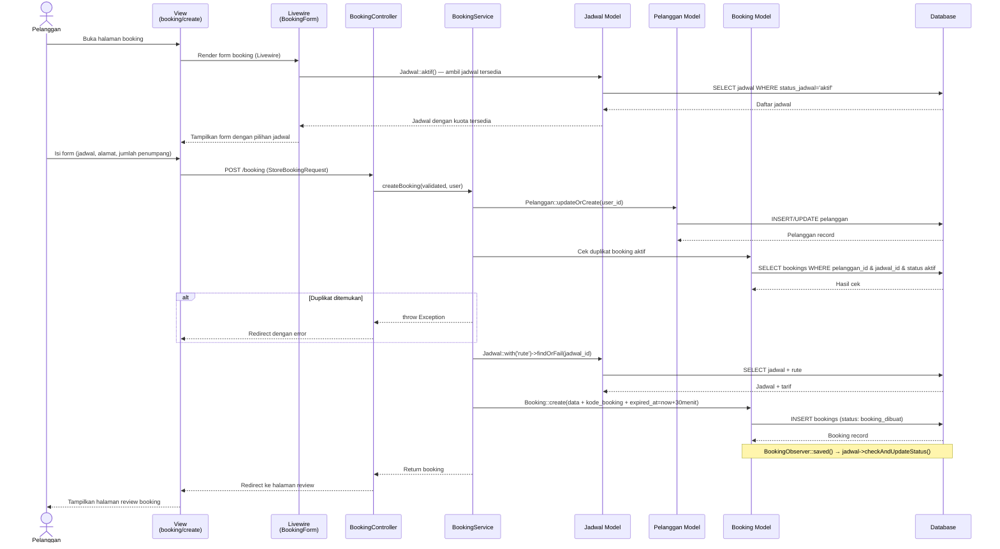

---

## 2. Pelanggan — Upload Bukti Pembayaran DP

**Controller:** `PembayaranController::show()`, `PembayaranController::store()`
**View:** `public.pembayaran.show`

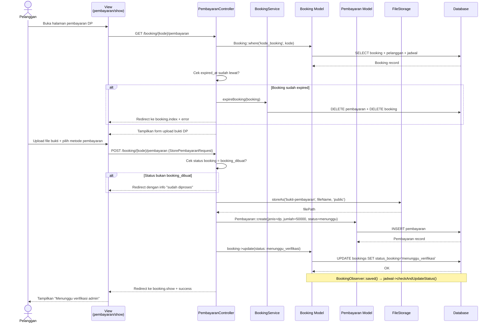

---

## 3. Admin — Verifikasi Pembayaran DP

**Controller:** `Admin\PembayaranController::verify()` atau **Livewire:** `PembayaranTable::verifyPayment()`
**Service:** `BookingWhatsappNotificationService::sendDpVerifiedToCustomer()`
**View:** `admin.pembayaran.index` (Livewire), `livewire.admin.pembayaran-table`

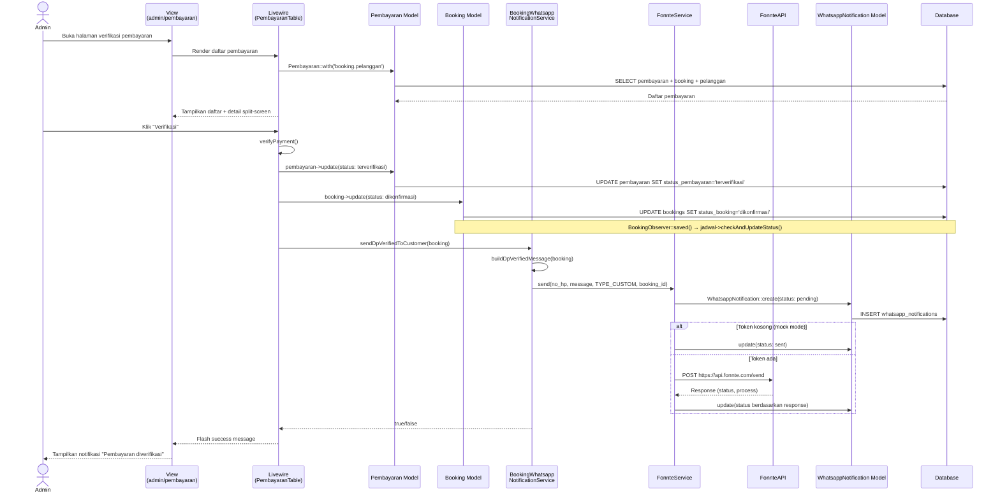

---

## 4. Admin — Tolak Pembayaran DP

**Controller:** `Admin\PembayaranController::reject()` atau **Livewire:** `PembayaranTable::rejectPayment()`

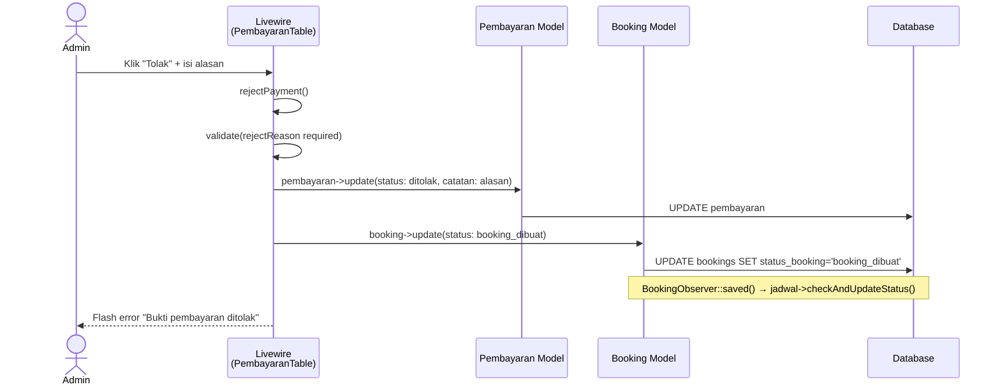

---

## 5. Admin — Buat Trip Baru

**Controller:** `Admin\TripController::create()`, `Admin\TripController::store()`
**View:** `admin.trips.create`

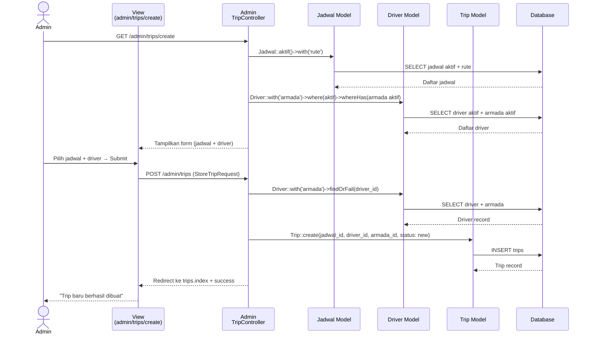

---

## 6. Admin — Assign Booking ke Trip

**Controller:** `Admin\TripController::assignBooking()`
**Observer:** `DetailTripObserver::created()`
**Service:** `BookingWhatsappNotificationService`

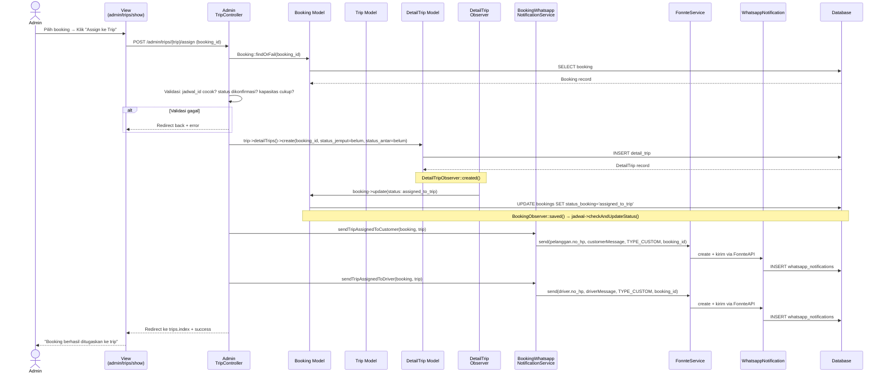

---

## 7. Admin — Approve Trip (new → ready)

**Controller:** `Admin\TripController::update()`
**Observer:** `TripObserver::updated()`

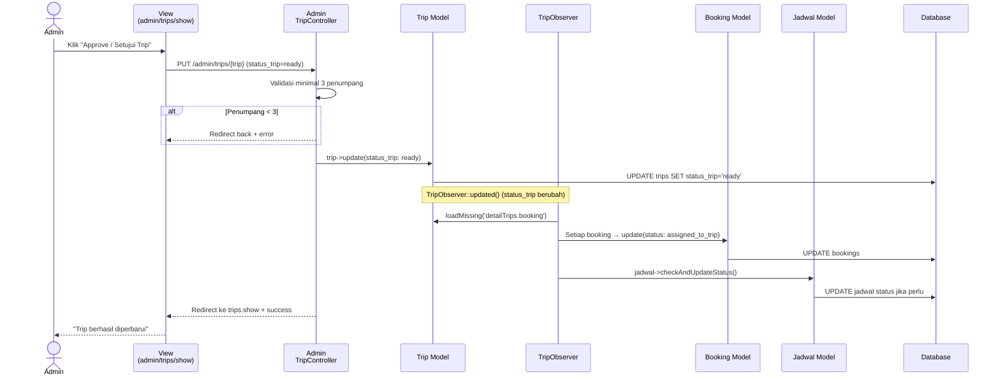

---

## 8. Driver — Mulai Trip (ready → on_trip)

**Controller:** `Driver\TripController::start()`
**Observer:** `TripObserver::updated()`

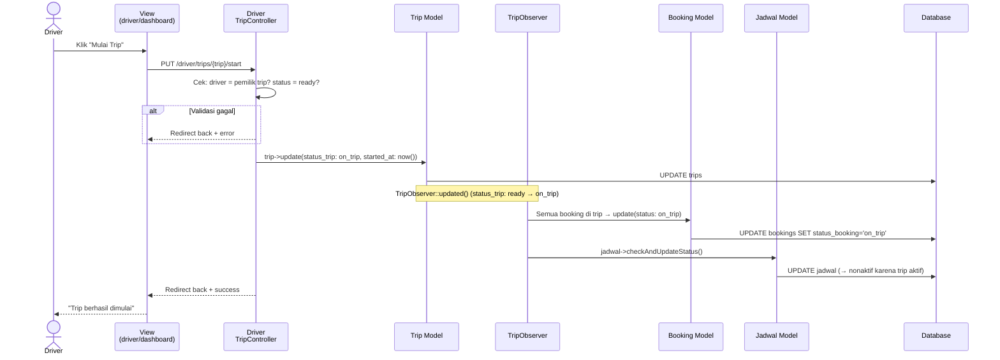

---

## 9. Driver — Jemput Penumpang

**Controller:** `Driver\TripController::pickup()`

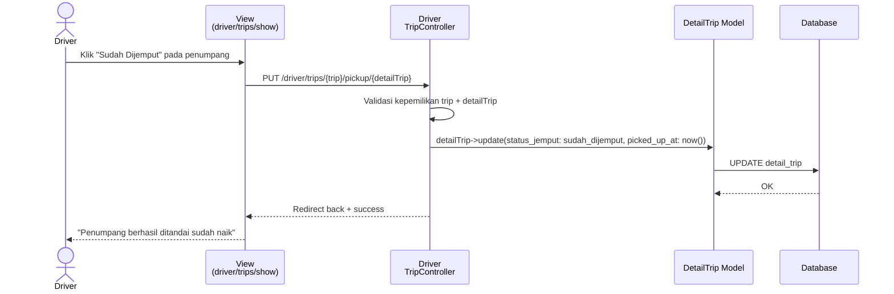

---

## 10. Driver — Antar Penumpang (Dropoff + Auto Pelunasan)

**Controller:** `Driver\TripController::dropoff()`

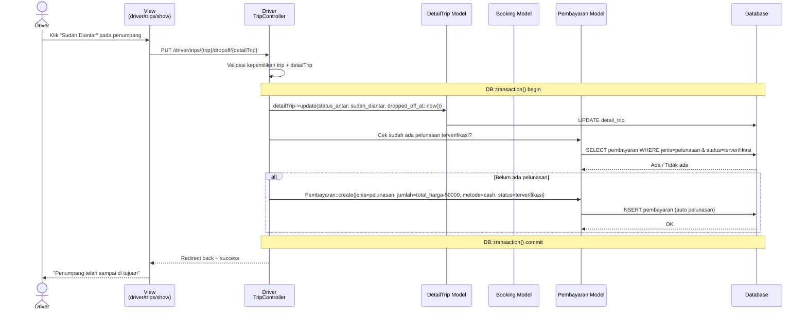

---

## 11. Driver — Selesaikan Trip (on_trip → completed)

**Controller:** `Driver\TripController::complete()`
**Observer:** `TripObserver::updated()`

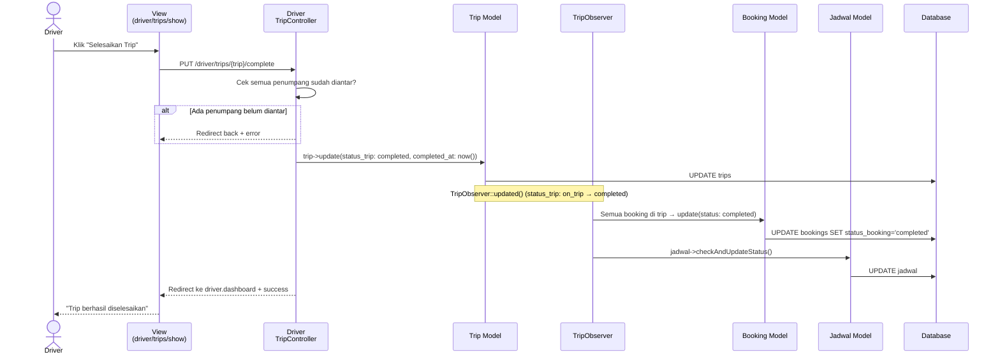

---

## 12. Pelanggan — Batalkan Booking

**Controller:** `BookingController::cancel()`

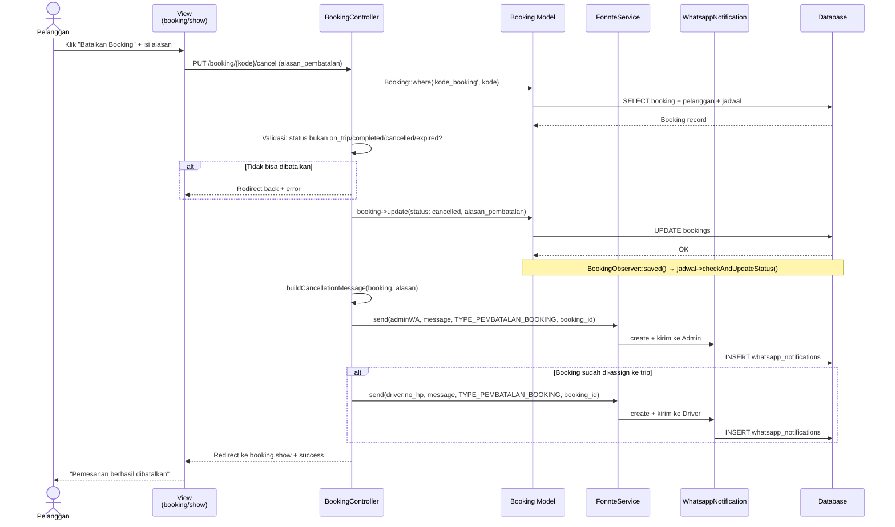

---

## 13. Pelanggan — Beri Rating & Ulasan

**Controller:** `RatingController::store()`

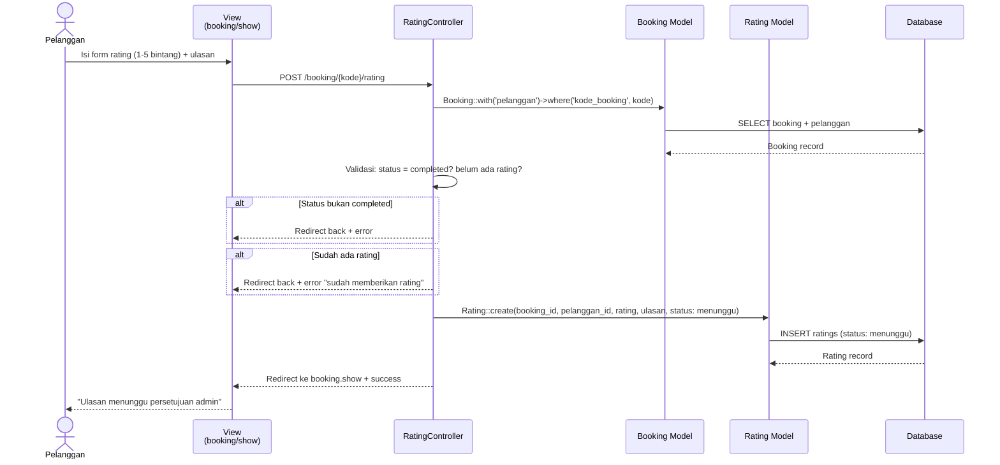

---

## 14. Admin — Kelola Rating (Publish/Hide/Hapus)

**Controller:** `Admin\RatingController`

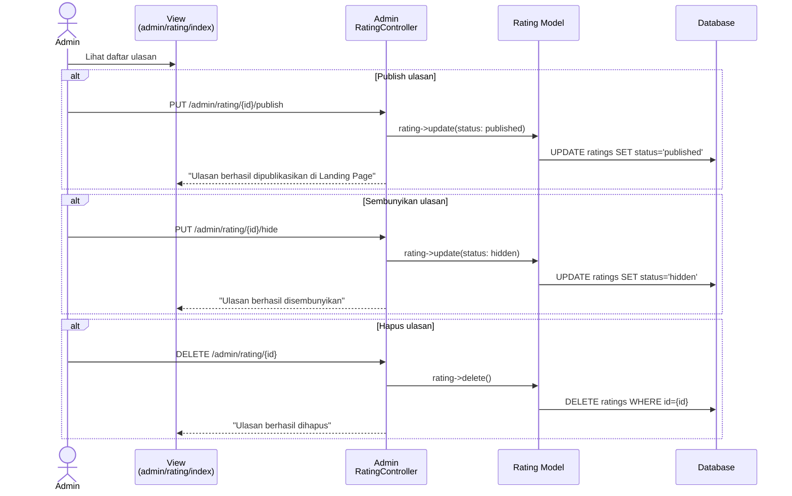

---

## 15. Sistem — Expirasi Booking Otomatis (Scheduler)

**Console:** `booking:expire` command
**Service:** `BookingService::expireBooking()`
**Schedule:** Setiap menit (`everyMinute()`)

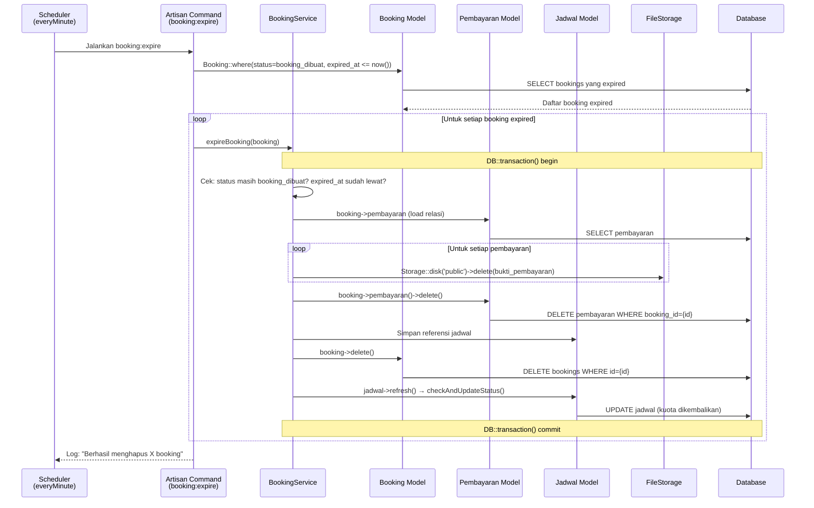

---

## 16. Sistem — Konfirmasi Keberangkatan Pagi (Scheduler)

**Console:** `booking:send-confirmation` command
**Schedule:** Setiap hari jam 06:00 WIB

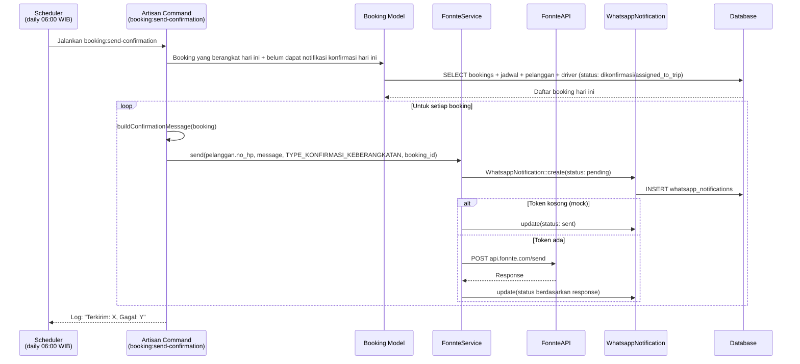

---

## 17. Pengunjung / Pelanggan — Cek Booking Publik

**Controller:** `CekBookingController::index()`, `CekBookingController::show()`
**View:** `public.cek-booking.index`, `public.cek-booking.show`

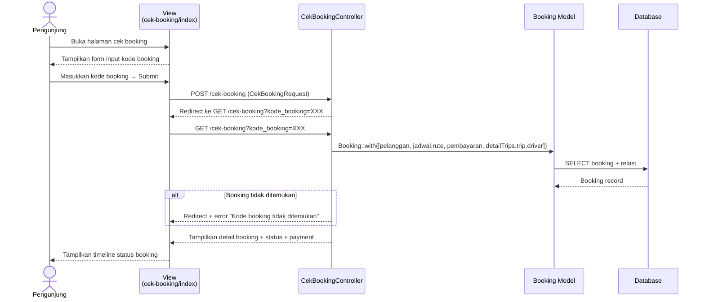

---

## 18. Pengunjung — Lihat Landing Page

**Controller:** `HomeController::index()`
**View:** `public.home`

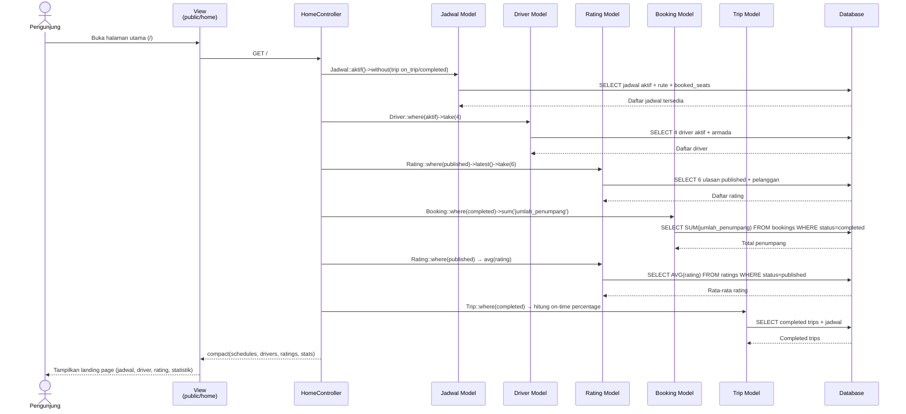

---

## 19. Admin — Kelola Master Data (Rute, Armada, Driver, Jadwal)

**Controller:** `Admin\RuteController`, `Admin\ArmadaController`, `Admin\DriverController`, `Admin\JadwalController`

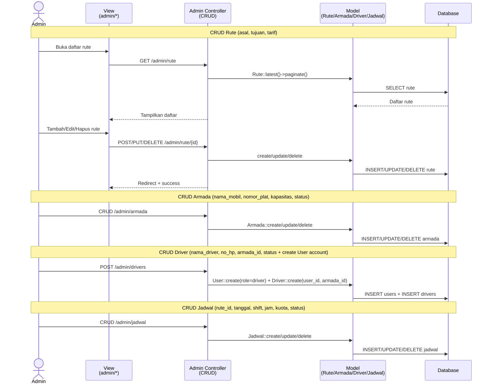

---

## Observer Pattern Summary

| Observer | Event | Aksi |
|---|---|---|
| `BookingObserver::saved()` | Setiap kali booking disimpan | `jadwal->checkAndUpdateStatus()` — Update status jadwal (aktif/penuh) |
| `BookingObserver::deleted()` | Booking dihapus | `jadwal->checkAndUpdateStatus()` — Kembalikan kuota |
| `DetailTripObserver::created()` | Booking di-assign ke trip | `booking->update(status: assigned_to_trip)` |
| `DetailTripObserver::deleted()` | Booking dikeluarkan dari trip | `booking->update(status: dikonfirmasi)` |
| `TripObserver::updated()` | Status trip berubah | Cascade update status semua booking di trip + `jadwal->checkAndUpdateStatus()` |
| `TripObserver::deleting()` | Trip dihapus | Semua booking dikembalikan ke status `dikonfirmasi` |
| `TripObserver::deleted()` | Setelah trip dihapus | `jadwal->checkAndUpdateStatus()` |

---

## Ringkasan Route

### Publik (Tanpa Login)
| Method | URL | Controller | Fungsi |
|---|---|---|---|
| GET | `/` | `HomeController::index` | Landing page |
| GET | `/jadwal` | `JadwalPublicController::index` | Lihat jadwal |
| GET | `/cek-booking` | `CekBookingController::index` | Cek status booking |
| POST | `/cek-booking` | `CekBookingController::show` | Submit kode booking |

### Pelanggan (role: pelanggan)
| Method | URL | Controller | Fungsi |
|---|---|---|---|
| GET | `/booking/create` | `BookingController::create` | Form booking |
| POST | `/booking` | `BookingController::store` | Simpan booking |
| GET | `/booking/{kode}/review` | `BookingController::review` | Review booking |
| GET | `/booking/{kode}/pembayaran` | `PembayaranController::show` | Form upload DP |
| POST | `/booking/{kode}/pembayaran` | `PembayaranController::store` | Upload bukti DP |
| GET | `/booking/{kode}/edit` | `BookingController::edit` | Edit lokasi |
| PUT | `/booking/{kode}` | `BookingController::update` | Update lokasi |
| PUT | `/booking/{kode}/cancel` | `BookingController::cancel` | Batalkan booking |
| GET | `/booking-saya` | `BookingController::index` | Daftar booking saya |
| GET | `/booking/{kode}` | `BookingController::show` | Detail booking |
| POST | `/booking/{kode}/rating` | `RatingController::store` | Beri rating |

### Admin (role: admin, prefix: /admin)
| Method | URL | Controller | Fungsi |
|---|---|---|---|
| GET | `/admin/dashboard` | `Admin\DashboardController::index` | Dashboard admin |
| Resource | `/admin/rute` | `Admin\RuteController` | CRUD Rute |
| Resource | `/admin/armada` | `Admin\ArmadaController` | CRUD Armada |
| Resource | `/admin/jadwal` | `Admin\JadwalController` | CRUD Jadwal |
| Resource | `/admin/drivers` | `Admin\DriverController` | CRUD Driver |
| Resource | `/admin/trips` | `Admin\TripController` | CRUD Trip |
| POST | `/admin/trips/{trip}/assign` | `Admin\TripController::assignBooking` | Assign booking ke trip |
| DELETE | `/admin/trips/{trip}/remove/{dt}` | `Admin\TripController::removeBooking` | Keluarkan dari trip |
| PUT | `/admin/pembayaran/{id}/verify` | `Admin\PembayaranController::verify` | Verifikasi DP |
| PUT | `/admin/pembayaran/{id}/reject` | `Admin\PembayaranController::reject` | Tolak DP |
| PUT | `/admin/rating/{id}/publish` | `Admin\RatingController::publish` | Publish ulasan |
| PUT | `/admin/rating/{id}/hide` | `Admin\RatingController::hide` | Sembunyikan ulasan |

### Driver (role: driver, prefix: /driver)
| Method | URL | Controller | Fungsi |
|---|---|---|---|
| GET | `/driver/dashboard` | `Driver\DashboardController::index` | Dashboard driver |
| GET | `/driver/trips` | `Driver\TripController::index` | Riwayat trip |
| GET | `/driver/trips/{trip}` | `Driver\TripController::show` | Detail trip |
| PUT | `/driver/trips/{trip}/start` | `Driver\TripController::start` | Mulai trip |
| PUT | `/driver/trips/{trip}/pickup/{dt}` | `Driver\TripController::pickup` | Jemput penumpang |
| PUT | `/driver/trips/{trip}/dropoff/{dt}` | `Driver\TripController::dropoff` | Antar penumpang |
| PUT | `/driver/trips/{trip}/complete` | `Driver\TripController::complete` | Selesaikan trip |
| PUT | `/driver/trips/{trip}/confirm-payment/{dt}` | `Driver\TripController::confirmPayment` | Konfirmasi pelunasan |
