# Use Case Diagram (UCD) - Sistem Informasi Singgalang Jaya Travel

Dokumen ini berisi kode **Mermaid** untuk merender Use Case Diagram (UCD) final proyek secara visual, beserta keterangan penjelasan dari masing-masing use case.

---

## 1. Kode Diagram (Mermaid.js)

```mermaid
flowchart TB
    %% Aktor-Aktor Sistem
    Pelanggan((Pelanggan))
    Admin((Admin))
    Driver((Driver))

    subgraph Sistem Informasi Singgalang Jaya Travel
        %% Usecase Umum
        UC_Login([Login])
        UC_Logout([Logout])

        %% Usecase Pelanggan
        UC_MelihatInfo([Melihat Informasi Travel])
        UC_MencariShift([Mencari & Memilih Shift Keberangkatan])
        UC_MelakukanBooking([Melakukan Pemesanan / Booking])
        UC_MembayarDP([Membayar DP])
        UC_UploadBuktiDP([Mengunggah Bukti Transfer DP])
        UC_MembatalkanBooking([Membatalkan Booking])
        UC_CekBooking([Cek Booking Saya])
        UC_UlasanRating([Memberikan Ulasan & Rating])
        UC_EditMaps([Mengelola Lokasi Penjemputan / Edit Maps])
        UC_EditPassenger([Mengelola / Edit Jumlah Penumpang])

        %% Usecase Admin
        UC_KelolaLaporan([Kelola Laporan])
        UC_LapPendapatan([Laporan Pendapatan])
        UC_LapTrip([Laporan Trip])
        UC_LapBooking([Laporan Booking])
        
        UC_KelolaDriver([Kelola Data Driver])
        UC_KelolaRute([Kelola Rute & Tarif])
        UC_KelolaJadwal([Kelola Jadwal Keberangkatan])
        
        UC_KelolaTrip([Kelola Trip])
        UC_TambahTrip([Tambah Trip])
        UC_AssignDriver([Assign Driver & Armada ke Trip])
        UC_InsertPassenger([Memasukkan Penumpang ke Trip])
        
        UC_KelolaArmada([Kelola Armada])
        UC_VerifikasiDP([Verifikasi Bukti DP])
        UC_TerimaDP([Terima DP])
        UC_TolakDP([Tolak DP])

        %% Usecase Driver
        UC_LihatTripManifest([Lihat Data Trip & Manifest Penumpang])
        UC_KonfirmasiPickup([Mengonfirmasi Status Penjemputan])
        UC_KonfirmasiPelunasan([Mengonfirmasi Pelunasan Tunai])
        UC_MenyelesaikanTrip([Menyelesaikan Status Perjalanan Trip])
    end

    %% Relasi Aktor Pelanggan
    Pelanggan --- UC_Login
    Pelanggan --- UC_Logout
    Pelanggan --- UC_MelihatInfo
    Pelanggan --- UC_MencariShift
    Pelanggan --- UC_MelakukanBooking
    Pelanggan --- UC_MembayarDP
    Pelanggan --- UC_MembatalkanBooking
    Pelanggan --- UC_CekBooking
    Pelanggan --- UC_UlasanRating
    Pelanggan --- UC_EditMaps
    Pelanggan --- UC_EditPassenger

    %% Relasi Aktor Admin
    Admin --- UC_Login
    Admin --- UC_Logout
    Admin --- UC_KelolaLaporan
    Admin --- UC_KelolaDriver
    Admin --- UC_KelolaRute
    Admin --- UC_KelolaJadwal
    Admin --- UC_KelolaTrip
    Admin --- UC_KelolaArmada
    Admin --- UC_VerifikasiDP

    %% Relasi Aktor Driver
    Driver --- UC_Login
    Driver --- UC_Logout
    Driver --- UC_LihatTripManifest
    Driver --- UC_KonfirmasiPickup
    Driver --- UC_KonfirmasiPelunasan
    Driver --- UC_MenyelesaikanTrip

    %% Usecase Includes & Extends
    UC_MembayarDP -.->|&lt;&lt;include&gt;&gt;| UC_UploadBuktiDP
    
    UC_KelolaLaporan -.->|&lt;&lt;extend&gt;&gt;| UC_LapPendapatan
    UC_KelolaLaporan -.->|&lt;&lt;extend&gt;&gt;| UC_LapTrip
    UC_KelolaLaporan -.->|&lt;&lt;extend&gt;&gt;| UC_LapBooking

    UC_KelolaTrip -.->|&lt;&lt;extend&gt;&gt;| UC_TambahTrip
    UC_KelolaTrip -.->|&lt;&lt;extend&gt;&gt;| UC_AssignDriver
    UC_KelolaTrip -.->|&lt;&lt;extend&gt;&gt;| UC_InsertPassenger

    UC_VerifikasiDP -.->|&lt;&lt;extend&gt;&gt;| UC_TerimaDP
    UC_VerifikasiDP -.->|&lt;&lt;extend&gt;&gt;| UC_TolakDP
```

---

## 2. Keterangan Penjelasan Per Use Case

Berikut adalah penjelasan fungsionalitas untuk setiap Use Case yang digambarkan pada diagram di atas:

### A. Use Case Umum (General Use Cases)
1. **Login**
   * **Aktor**: Pelanggan, Admin, Driver
   * **Penjelasan**: Pengguna memasukkan data email/no WhatsApp dan password ke dalam sistem untuk masuk ke dalam aplikasi sesuai dengan hak akses (role) masing-masing.
2. **Logout**
   * **Aktor**: Pelanggan, Admin, Driver
   * **Penjelasan**: Pengguna keluar dari sesi aktif di aplikasi untuk menjaga keamanan akun.

---

### B. Use Case Aktor: Pelanggan
3. **Melihat Informasi Travel**
   * **Aktor**: Pelanggan (termasuk Guest/Tamu)
   * **Penjelasan**: Pengguna melihat profil, kontak, daftar armada, testimoni, dan rute populer yang ditawarkan di halaman depan (landing page) aplikasi.
4. **Mencari & Memilih Shift Keberangkatan**
   * **Aktor**: Pelanggan (termasuk Guest/Tamu)
   * **Penjelasan**: Pengguna menyaring jadwal keberangkatan berdasarkan stasiun asal, tujuan, tanggal, serta memilih ketersediaan shift Pagi atau Malam.
5. **Melakukan Pemesanan / Booking**
   * **Aktor**: Pelanggan (Terautentikasi)
   * **Penjelasan**: Pelanggan memesan kursi travel dengan menginput data penumpang, alamat penjemputan, tujuan, jumlah kursi, dan jadwal terpilih.
6. **Membayar DP**
   * **Aktor**: Pelanggan
   * **Penjelasan**: Pelanggan melakukan pembayaran uang muka untuk mengunci pemesanan. *Use case* ini wajib menyertakan (**include**) proses mengunggah bukti pembayaran.
7. **Mengunggah Bukti Transfer DP** *(Include dari Membayar DP)*
   * **Aktor**: Pelanggan
   * **Penjelasan**: Pelanggan mengambil gambar/screenshot bukti transfer bank lalu mengunggahnya ke sistem sebagai klaim pembayaran DP.
8. **Membatalkan Booking**
   * **Aktor**: Pelanggan
   * **Penjelasan**: Pelanggan membatalkan pemesanan secara mandiri sebelum trip dijalankan, dengan konsekuensi biaya DP otomatis hangus.
9. **Cek Booking Saya**
   * **Aktor**: Pelanggan
   * **Penjelasan**: Pelanggan memantau status pemesanan aktif (apakah menunggu verifikasi, lunas, sedang trip, dsb.) dan melihat riwayat perjalanan lampau.
10. **Mengelola Lokasi Penjemputan / Edit Maps**
    * **Aktor**: Pelanggan
    * **Penjelasan**: Pelanggan menentukan letak pin penjemputan secara geografis (*latitude/longitude*) melalui peta interaktif OpenStreetMap.
11. **Mengelola / Edit Jumlah Penumpang**
    * **Aktor**: Pelanggan
    * **Penjelasan**: Pelanggan mengubah kuantitas jumlah kursi yang dipesan dalam satu kode booking sebelum statusnya dikunci oleh trip manifes.
12. **Memberikan Ulasan & Rating**
    * **Aktor**: Pelanggan
    * **Penjelasan**: Pelanggan memberikan rating bintang 1-5 dan komentar ulasan setelah perjalanan trip diselesaikan.

---

### C. Use Case Aktor: Admin
13. **Kelola Laporan**
    * **Aktor**: Admin
    * **Penjelasan**: Admin mengorganisasi statistik laporan performa travel. *Use case* ini diperluas (**extend**) oleh beberapa jenis laporan yang lebih spesifik.
14. **Laporan Pendapatan** *(Extend dari Kelola Laporan)*
    * **Aktor**: Admin
    * **Penjelasan**: Admin melihat ringkasan agregasi keuangan (DP masuk, pelunasan tunai, DP hangus) dan mengekspornya ke CSV.
15. **Laporan Trip** *(Extend dari Kelola Laporan)*
    * **Aktor**: Admin
    * **Penjelasan**: Admin melihat total ritase perjalanan driver, armada paling aktif, dan rata-rata load factor kursi terisi.
16. **Laporan Booking** *(Extend dari Kelola Laporan)*
    * **Aktor**: Admin
    * **Penjelasan**: Admin memantau grafik jumlah pemesanan tiket bulanan, booking sukses, dan booking dibatalkan.
17. **Kelola Data Driver**
    * **Aktor**: Admin
    * **Penjelasan**: Admin melakukan manajemen CRUD data master supir (driver) beserta sinkronisasi akun login.
18. **Kelola Rute & Tarif**
    * **Aktor**: Admin
    * **Penjelasan**: Admin melakukan manajemen CRUD data rute operasional dan penetapan harga dasar tiket perjalanan.
19. **Kelola Jadwal Keberangkatan**
    * **Aktor**: Admin
    * **Penjelasan**: Admin menyusun jadwal keberangkatan harian bersistem shift (Pagi 08:00 dan Malam 20:00 WIB).
20. **Kelola Trip**
    * **Aktor**: Admin
    * **Penjelasan**: Admin merencanakan lembar trip nyata. *Use case* ini diperluas (**extend**) oleh proses penambahan trip, penugasan kru, dan pengisian manifest.
21. **Tambah Trip** *(Extend dari Kelola Trip)*
    * **Aktor**: Admin
    * **Penjelasan**: Admin membuat trip harian baru untuk jadwal tertentu pada tanggal berjalan.
22. **Assign Driver & Armada ke Trip** *(Extend dari Kelola Trip)*
    * **Aktor**: Admin
    * **Penjelasan**: Admin memasangkan driver dan armada mobil yang kosong (*available*) ke dalam trip tersebut.
23. **Memasukkan Penumpang ke Trip** *(Extend dari Kelola Trip)*
    * **Aktor**: Admin
    * **Penjelasan**: Admin menyeleksi pemesanan pelanggan terkonfirmasi lalu memasukkan data penumpang tersebut ke manifes perjalanan trip.
24. **Kelola Armada**
    * **Aktor**: Admin
    * **Penjelasan**: Admin melakukan manajemen CRUD data master mobil travel operasional.
25. **Verifikasi Bukti DP**
    * **Aktor**: Admin
    * **Penjelasan**: Admin memeriksa keabsahan bukti transfer DP dari bank. *Use case* ini diperluas (**extend**) oleh aksi penerimaan atau penolakan bukti DP.
26. **Terima DP** *(Extend dari Verifikasi Bukti DP)*
    * **Aktor**: Admin
    * **Penjelasan**: Admin menyetujui bukti pembayaran, mengubah status booking menjadi `dikonfirmasi`, dan memicu notifikasi WhatsApp lunas DP ke pelanggan.
27. **Tolak DP** *(Extend dari Verifikasi Bukti DP)*
    * **Aktor**: Admin
    * **Penjelasan**: Admin menolak bukti pembayaran dan meminta pelanggan mengunggah ulang bukti pembayaran yang benar.

---

### D. Use Case Aktor: Driver
28. **Lihat Data Trip & Manifest Penumpang**
    * **Aktor**: Driver
    * **Penjelasan**: Driver melihat tugas trip hari ini beserta daftar manifes nama penumpang, sisa biaya tiket, alamat jemput, dan kontak telepon penumpang.
29. **Mengonfirmasi Status Penjemputan**
    * **Aktor**: Driver
    * **Penjelasan**: Driver memperbarui status penumpang secara dinamis (dari status belum dijemput -> sudah dijemput/pickup -> sudah diturunkan/dropoff).
30. **Mengonfirmasi Pelunasan Tunai**
    * **Aktor**: Driver
    * **Penjelasan**: Driver menerima pembayaran tunai sisa biaya tiket di lapangan dan mencatat pelunasan tersebut ke sistem secara *real-time*.
31. **Menyelesaikan Status Perjalanan Trip**
    * **Aktor**: Driver
    * **Penjelasan**: Driver mengakhiri perjalanan (mengubah status trip menjadi `completed`) setelah seluruh penumpang sampai di tujuan masing-masing secara lunas.
